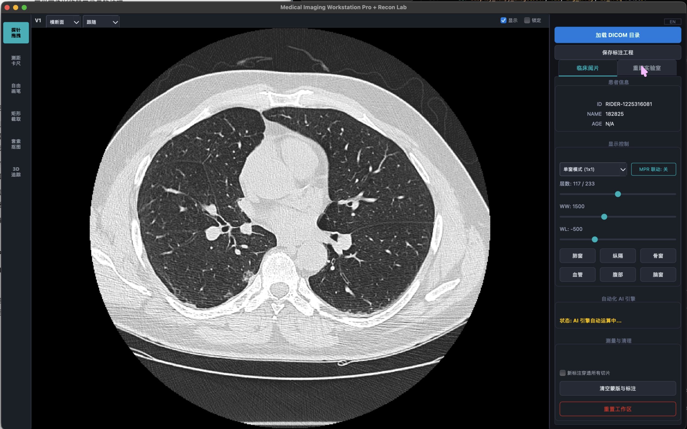
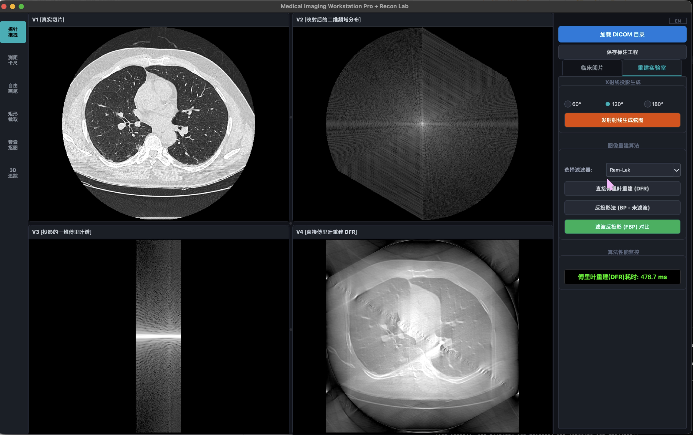
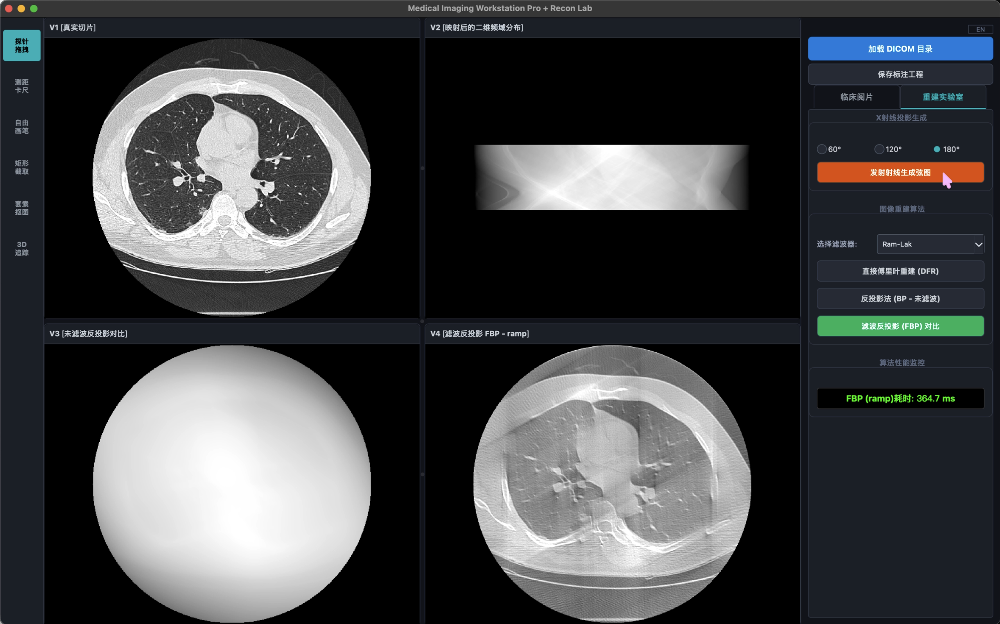

# 医学影像工作站 Pro · Recon Lab

> Medical Imaging Workstation Pro — a desktop **DICOM viewer + CT reconstruction lab + AI lung segmentation**, built with PySide6.


**[中文](#中文) · [English](#english)** — 界面与文档均支持中英文切换 / UI and docs are fully bilingual.





---

## 中文

一款功能齐全的桌面医学影像工作站,集 **DICOM 阅片**、**多种 CT 重建算法** 与 **AI 肺部分割** 于一体,基于 PySide6 构建。界面一键中英文切换。

### 技术栈

Python · PySide6 · PyDicom · NumPy · SciPy · scikit-image · ONNX Runtime

### 核心功能

**影像阅片**
- 233 层真实患者 CT,支持 Axial / Coronal / Sagittal 三方向 MPR 导航,十字线联动
- 6 种临床预设窗位:肺窗 / 纵隔 / 骨窗 / 血管 / 腹部 / 脑窗,每个视图可独立设窗
- 缩放、平移、交互调窗、HU 测量、距离测量、病灶标注与导出

**CT 重建实验室**
- 解析法:BP(纯反投影)、FBP(滤波反投影)、DFR(直接傅里叶重建)
- 代数法:DMR(系统矩阵直接求解)、ART、SIRT(迭代重建)
- 正弦图(sinogram)生成与重建结果实时对比

**AI 辅助**
- ONNX 异步后台推理,自动肺部分割(daemon 线程,不阻塞 UI)

### 重建算法一览

| 算法 | 类别 | 说明 |
|------|------|------|
| **BP** | 解析 | 纯反投影,不做频域滤波,呈现经典的模糊星状伪影 |
| **FBP** | 解析 | 滤波反投影,内置 5 种滤波器:Ram-Lak / Shepp-Logan / Cosine / Hamming / Hann |
| **DFR** | 解析 | 直接傅里叶重建,正弦图经一维 FFT → 极坐标插值 → 二维逆 FFT |
| **DMR** | 代数 | 系统矩阵最小二乘直接求解(伪逆),一次解出、非迭代 |
| **ART** | 代数 | 代数重建技术(Kaczmarz),逐条射线迭代修正,收敛快但对噪声敏感 |
| **SIRT** | 代数 | 联立迭代重建,每轮用全部射线同步更新,结果更平滑稳定 |

> 代数法(DMR / ART / SIRT)都先构建系统矩阵 A(带缓存):DMR 用最小二乘一次解出,ART / SIRT 则迭代逼近。

### 项目结构

| 文件 | 职责 |
|------|------|
| `main.py` | 主窗口与业务逻辑(`MedicalViewer`) |
| `graphics_view.py` | 自定义 `QGraphicsView`:影像交互 / 调窗 / 标注 / MPR 十字线 |
| `recon.py` | 纯计算重建算法(BP/FBP/DFR/ART/SIRT/DMR),不依赖 Qt |
| `ai_engine.py` | 异步 AI 肺分割推理引擎 |
| `constants.py` | 跨 UI 与业务层共享的常量(工具 ID / MPR 平面) |
| `style.qss` | Qt 界面样式 |

> 注:模型权重(`lung_seg_model.onnx`)与 DICOM 影像数据体积较大、属敏感数据,**不包含在仓库中**,需自行准备并放入对应目录。

### 安装

```bash
# 建议在虚拟环境中安装
pip install PySide6 pydicom numpy scipy scikit-image onnxruntime
```

> 需 Python 3.9+。AI 分割为可选功能,缺少 `onnxruntime` 或模型文件时其余功能不受影响。

### 运行

```bash
python main.py
```

### 基本操作

| 操作 | 说明 |
|------|------|
| 拖拽 | 平移影像 |
| 滚轮 | 缩放 |
| 单击 | 测量该点 HU 值 |
| 右键拖拽 | 实时调节窗宽 / 窗位(WW / WL) |
| 预设按钮 | 一键切换肺窗 / 纵隔 / 骨窗 / 血管 / 腹部 / 脑窗 |
| MPR 按钮 | 切换 Axial / Coronal / Sagittal 三方向 |

### 授权

详见 [LICENSE](LICENSE)。MIT。

---

## English

A full-featured desktop medical imaging workstation that combines **DICOM viewing**, **multiple CT reconstruction algorithms**, and **AI lung segmentation**, built with PySide6. The UI switches between English and Chinese with one click.

### Tech Stack

Python · PySide6 · PyDicom · NumPy · SciPy · scikit-image · ONNX Runtime

### Features

**Image Viewing**
- 233-slice real patient CT, with Axial / Coronal / Sagittal MPR navigation and linked cross-hairs
- 6 clinical window presets: Lung / Mediastinum / Bone / Vascular / Abdomen / Brain, each view independently configurable
- Zoom, pan, interactive windowing, HU probing, distance measurement, lesion annotation & export

**CT Reconstruction Lab**
- Analytic: BP (back-projection), FBP (filtered back-projection), DFR (direct Fourier reconstruction)
- Algebraic: DMR (direct matrix solve), ART, SIRT (iterative)
- Sinogram generation with side-by-side comparison of results

**AI Assistance**
- Asynchronous ONNX inference for automatic lung segmentation (daemon thread, non-blocking UI)

### Reconstruction Algorithms

| Algorithm | Type | Notes |
|-----------|------|-------|
| **BP** | Analytic | Pure back-projection, no frequency filtering — the classic blurry star artifact |
| **FBP** | Analytic | Filtered back-projection with 5 filters: Ram-Lak / Shepp-Logan / Cosine / Hamming / Hann |
| **DFR** | Analytic | Direct Fourier reconstruction: 1-D FFT of sinogram → polar interpolation → 2-D inverse FFT |
| **DMR** | Algebraic | Least-squares direct solve (pseudo-inverse) on system matrix A — solved once, not iterative |
| **ART** | Algebraic | Algebraic Reconstruction Technique (Kaczmarz), ray-by-ray iterative correction — fast but noise-sensitive |
| **SIRT** | Algebraic | Simultaneous Iterative Reconstruction, updates from all rays per pass — smoother & more stable |

> Algebraic methods (DMR / ART / SIRT) all build a (cached) system matrix A: DMR solves it once via least squares, while ART / SIRT iterate.

### Project Structure

| File | Responsibility |
|------|----------------|
| `main.py` | Main window & application logic (`MedicalViewer`) |
| `graphics_view.py` | Custom `QGraphicsView`: image interaction / windowing / annotation / MPR cross-hairs |
| `recon.py` | Pure reconstruction algorithms (BP/FBP/DFR/ART/SIRT/DMR), Qt-free |
| `ai_engine.py` | Asynchronous AI lung-segmentation engine |
| `constants.py` | Shared constants across UI and logic (tool IDs / MPR planes) |
| `style.qss` | Qt stylesheet |

> Note: model weights (`lung_seg_model.onnx`) and DICOM data are large and sensitive, so they are **not included in this repository** — prepare your own and place them in the corresponding folders.

### Installation

```bash
# Install in a virtual environment is recommended
pip install PySide6 pydicom numpy scipy scikit-image onnxruntime
```

> Requires Python 3.9+. AI segmentation is optional; everything else works without `onnxruntime` or the model file.

### Run

```bash
python main.py
```

### Basic Controls

| Action | Result |
|--------|--------|
| Drag | Pan the image |
| Scroll | Zoom |
| Click | Probe HU value at that point |
| Right-drag | Adjust window width / level (WW / WL) in real time |
| Preset buttons | Switch Lung / Mediastinum / Bone / Vascular / Abdomen / Brain windows |
| MPR buttons | Switch Axial / Coronal / Sagittal views |

### License

See [LICENSE](LICENSE). MIT.
