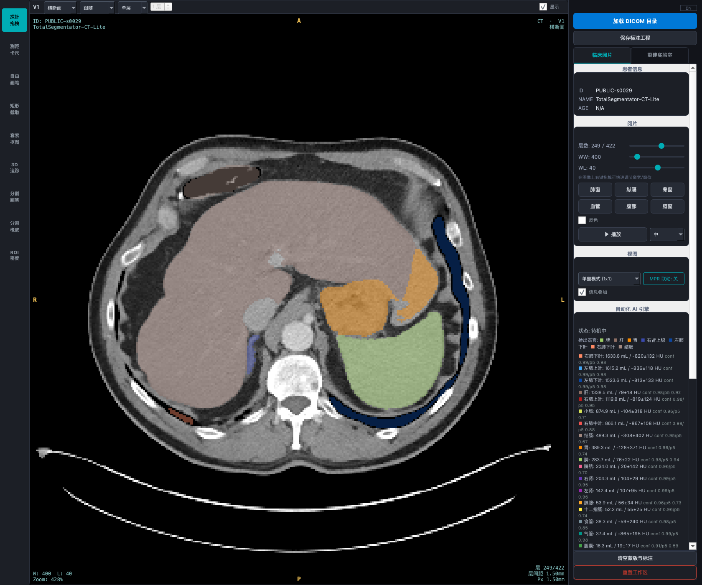
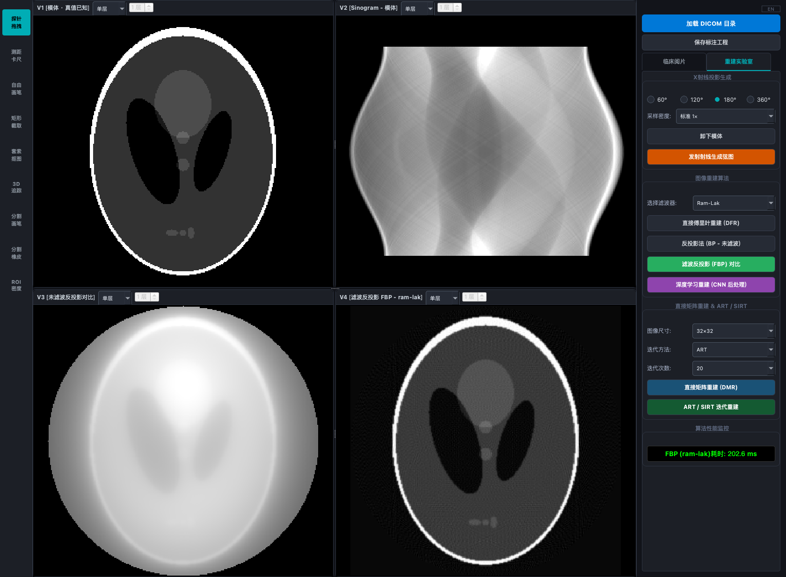
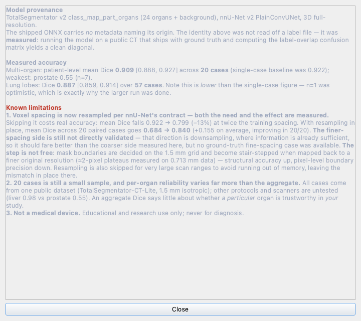
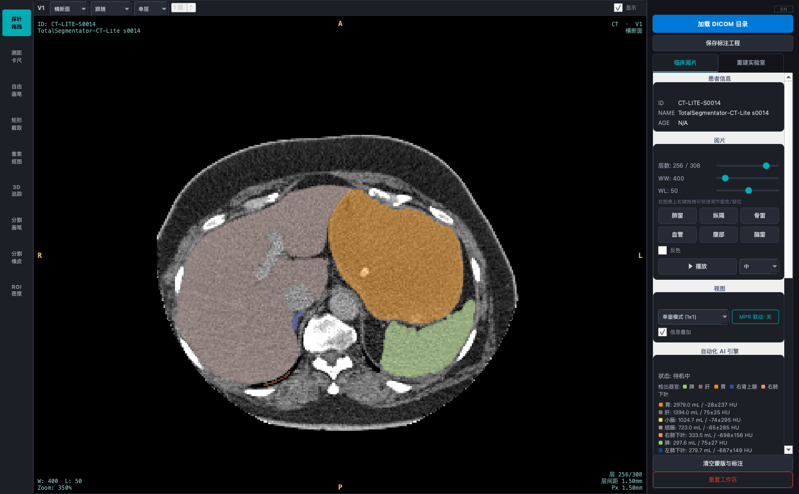
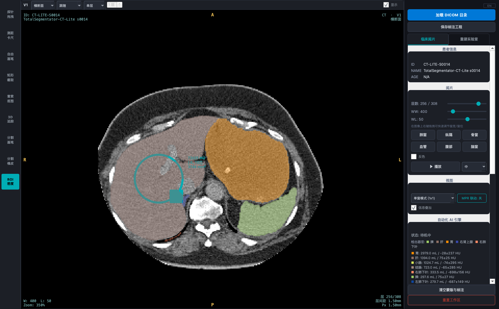
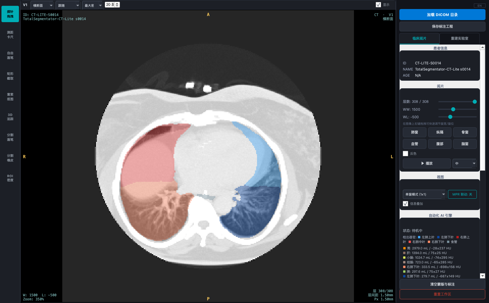
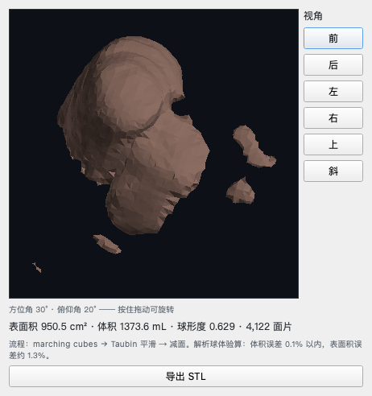

<h1 align="center">Medical Imaging Workstation + Reconstruction Lab</h1>

<p align="center"><strong>A medical-imaging algorithm portfolio</strong> — CT reconstruction, 3D segmentation,<br>and the measurement work that decides whether either can be believed</p>

<p align="center"><strong>English</strong> · <a href="README.zh-CN.md">简体中文</a></p>

<p align="center">
  <a href="https://github.com/sunce764/medical-imaging-workstation/actions/workflows/ci.yml"></a>
  
  
  <a href="LICENSE"></a>
  
</p>

**3D multi-organ CT segmentation and tomographic reconstruction**, wrapped in a clinical-style DICOM workstation (PySide6/Qt6, CPU-only).

- **Written from first principles** — direct Fourier reconstruction via the central-slice theorem, the analytic Shepp-Logan phantom, and the DMR / ART / SIRT / ASD-POCS iterative solvers.
- **Two networks trained from scratch** — a 1.9 M residual U-Net for sparse-view reconstruction, and a 0.35 M 3D U-Net for lung lobes.
- **A shipped model that arrived with no documented origin** — its **label scheme** identified by measurement, then validated against public ground truth on 20- and 57-case samples drawn from a 297-case public dataset.
- **Four quantitative studies, two multi-case validations, and an ablation that changed the product** — the reconstruction studies directly `import recon`, the workstation's numerical module; every studied solver, ASD-POCS included, is selectable in the GUI's reconstruction lab. The segmentation studies run the very same `organs.onnx`, either by replicating `ai_engine`'s pipeline or by calling it — but most of that evidence was measured before `2a50e37` changed the product's last-window handling, so those rows are historical pre-fix evidence rather than a step-for-step equivalent of the shipped path. Which arm sits on which side is recorded per artifact, not asserted in one line (§Measured evidence).

> [!WARNING]
> **Teaching and research only.** This software is not a certified medical device and must not be used for clinical diagnosis. AI segmentation and organ measurements are automated estimates, not clinical findings.

## Three results, if you only read one section

**A model–inference-path interaction.** The same student weights score **0.490 or 0.746** Dice when only the tensor extent changes: fixed-size/no-augmentation training meets zero-padding and `InstanceNorm3d`, whose per-sample spatial statistics change with the padded extent. Enlarging the tensor erased **99.3 %** of predicted foreground (225,374 → 1,529 voxels). Five targeted controls narrow the mechanism toward normalisation sensitivity, but no replacement-normalisation experiment was run, so they do not establish a unique cause or show that the model itself is sound.

**An ablation that changed the product.** The engine was silently skipping nnU-Net's mandatory resampling to the training spacing. Measured first, fixed second: Dice **0.684 → 0.840**, improving **20 of 20** paired cases (Wilcoxon *p* = 1.9×10⁻⁶), while inference on the local RIDER series fell from **100 s / 8.8 GB to 37 s / 3.0 GB** — more accurate *and* cheaper.

**A pilot result that did not survive.** A 3-case pilot advertised **+0.205** for the z-blocking factor; the designated 61-case test split — held out from student training, but probably seen during teacher training and subsequently evaluated multiple times here — has 59 evaluable cases and says **+0.0133** [+0.0072, +0.0194]. Both numbers are in this repository. The full-split run exists precisely to stop an outlier from becoming the headline.

Python 3.10 · PySide6/Qt6 · **CPU-only, no GPU** · synthetic phantoms and de-identified public research CTs · **no PHI is committed**.

### Reviewing this as an algorithm portfolio? Start with these four files

| File | What it holds | Backing artefacts |
|---|---|---|
| [`recon.py`](recon.py) | Direct Fourier reconstruction from the central-slice theorem (incl. the half-pixel correction for even sizes), the analytic Shepp-Logan phantom, and the DMR / ART / SIRT / ASD-POCS solvers — all written from first principles (ASD-POCS follows the Sidky & Pan 2008 pseudocode). Radon/FBP call scikit-image; the table below says which is which | [`exp_a_dose_quality.csv`](experiments/results/exp_a_dose_quality.csv), [`exp_b_filters.csv`](experiments/results/exp_b_filters.csv) |
| [`seg3d_infer_bias.py`](experiments/seg3d_infer_bias.py) | Five controls on the student's tensor-extent / padding / normalisation interaction, plus a separate product-teacher z-overlap A/B and the streaming fusion needed for its paired 59-case run | [`_pad.csv`](experiments/results/seg3d_infer_bias_pad.csv), [`_norm.csv`](experiments/results/seg3d_infer_bias_norm.csv), [`_bench_A.csv`](experiments/results/seg3d_infer_bias_bench_A.csv) / [`_bench_B.csv`](experiments/results/seg3d_infer_bias_bench_B.csv) |
| [`seg3d_train.py`](experiments/seg3d_train.py) · [`seg3d_eval.py`](experiments/seg3d_eval.py) | 3D U-Net trained from scratch: patient-level split (`SPLIT_SEED=0` → 207/29/61), paired evaluation, bootstrap CI, Wilcoxon | [`seg3d_student_*_zslab.csv`](experiments/results/seg3d_student_ch8d3_33600s_zslab.csv), [`seg3d_teacher_dice.csv`](experiments/results/seg3d_teacher_dice.csv) |
| [`recon_dl.py`](experiments/recon_dl.py) | 1.9 M residual U-Net for sparse-view reconstruction, measured for hallucination rate and out-of-distribution transfer rather than RMSE alone | [`recon_dl_matrix.csv`](experiments/results/recon_dl_matrix.csv), [`recon_dl_hallucination.csv`](experiments/results/recon_dl_hallucination.csv), [`recon_dl_ood.csv`](experiments/results/recon_dl_ood.csv) |

For a long-form Chinese audit of the product, four studies, evidence levels, reproducibility, licensing, and remaining risks, see the [comprehensive project report](docs/project_report_zh.md).

Most figures above are recomputable from the committed CSVs — but not all, so the exceptions are named rather than waved at. Parameter counts come from the two committed `.onnx` graphs; the 207/29/61 split from `seg3d_data.split()` over the manifest. Three cost figures are **single-machine measurements that were never archived**: the `8.44 / 9.09 GB` pair in Study IV, and the `100 s / 8.8 GB` → `37 s / 3.0 GB` pair for the local RIDER series. They were measured, not estimated, but nothing in `results/` lets a reader check them. This paragraph is the single place that discloses it — the figures themselves appear in the sections above without a repeated caveat attached to each one.

## Interface

| AI multi-organ segmentation | Tri-planar MPR with linked cross-hairs |
|:---:|:---:|
|  |  |

**Per-voxel confidence alongside every measurement.** Each organ row carries the model's softmax max-class probability and its 5th percentile — the low percentile is the revealing one, since errors concentrate at boundaries. Entries below 0.9 are flagged; in the run below the gallbladder (`conf 0.88 / p5 0.54`) is the one the model is least sure about, matching what the spacing ablation independently found to be the most fragile structure.



| Reconstruction lab, no data required | Model card: provenance and limits |
|:---:|:---:|
|  |  |

The **built-in Shepp-Logan phantom** makes the whole reconstruction pipeline usable with nothing imported — V3 is unfiltered back-projection (a blur), V4 the filtered version resolving the same phantom down to its smallest lesions. Because the phantom's ground truth is known analytically, the error view measures distance to the truth rather than to another reconstruction. The **model card** states how the model's identity was established by measurement, how far it has been validated, and what remains unmeasured; every measured figure on it is read live from `experiments/results/`, so re-running an experiment updates the card.

| Organ quantification with per-organ HU | ROI density readout |
|:---:|:---:|
|  |  |

**Left/right is verifiable by eye.** In the abdominal window the liver sits on the `R` side and the stomach and spleen on `L`, which is what the orientation contract in `ai_engine` is there to guarantee — the labels are checked against CT-Lite's own ground truth, not just rendered. The **ROI** reports mean±SD, range and area in physical units; those units appear only when the series proves its spacing and HU calibration, otherwise the readout says so instead of inventing a number.

| Thick-slab MIP over 20 slices | 3D surface reconstruction |
|:---:|:---:|
|  |  |

**MIP** projects the brightest voxel through a slab, which is how pulmonary vessels and nodules are read; MinIP and AIP share the control for airways and for noise reduction. The **surface reconstruction** runs marching cubes over one label and reports surface area, volume and sphericity, with the mesh exportable as STL — the shape statistics are validated against an analytic sphere (volume within 0.1%, surface area within ~1.3%).

> Screenshots use **TotalSegmentator-CT-Lite** (CC-BY-4.0), a de-identified public research dataset; no PHI is committed to this repository. The phantom and model-card views need no data at all.

## Core capabilities

| Area | What is included |
|---|---|
| **Clinical reading** | Classic single-frame CT loading with patient-space sorting when geometry is provable · tri-planar MPR with linked cross-hairs only for canonical series with valid in-plane and uniform z geometry · HU presets/ROI/AI and other intensity consumers independently require valid CT calibration · slab MIP / MinIP / AIP · 9 measurement and annotation tools with capability gates · ellipse ROI statistics · four-corner PACS overlay · Cine playback · dual-series follow-up comparison for series meeting the full geometry/intensity contract. Enhanced/multi-frame and non-CT inputs are rejected; non-canonical or incomplete geometry remains viewer-only where safe |
| **AI segmentation** | Background sliding-window ONNX inference for 25 classes, including 5 lung lobes · tri-planar colour overlay and clickable legend · cursor HUD · per-organ statistics and CSV export · 3-D marching-cubes surface preview, shape features and STL export · brush/eraser editing with undo · per-voxel confidence reporting |
| **Reconstruction lab** | Built-in analytic Shepp-Logan phantom · Radon projection · BP / FBP with 5 filters / DFR · first-principles DMR, ART, SIRT and ASD-POCS (TV-regularised) solvers · error maps and RMSE · learned CNN post-processing with its training-view and input-filter constraints shown in the UI |
| **Safety and review** | On-screen identity is replaced by `ANON`; explicit export filenames use a per-load random `ANON-…` alias and collision-safe suffixes · explicit warning that DICOM tags, internal project/cache identifiers, and burned-in pixel text are not anonymised · persistent AI disclaimer · model card covering measured provenance and unmeasured limits · bilingual EN / 中文 interface |

## Implemented here, or called from a library

Stated explicitly, because "I built a CT reconstruction lab" means very different things depending on the answer.

| Component | How it exists here | Where |
|---|---|---|
| Radon projection · BP · FBP with 5 filters | **Called** — `skimage.transform.radon` / `iradon` | [`recon.py`](recon.py) |
| Direct Fourier reconstruction (DFR) | **Written from first principles** — central-slice theorem: 1-D FFT per projection, polar→Cartesian interpolation, 2-D inverse FFT. Includes a half-pixel correction for even sizes that took a real debugging pass to find | [`recon.py`](recon.py) |
| Shepp-Logan phantom | **Written from first principles** — ten analytic ellipses, not a bitmap from a library, so it renders at any resolution without interpolation loss | [`recon.py`](recon.py) |
| System matrix · DMR · ART · SIRT | **Written from first principles** — per-pixel matrix construction with caching; ART is Kaczmarz row-action with precomputed row norms | [`recon.py`](recon.py) |
| ASD-POCS (TV-regularised iterative reconstruction) | **Written from first principles** — Sidky & Pan (2008) §2.4.2 pseudocode, literature parameters; the TV gradient is checked against finite differences in the test suite | [`recon.py`](recon.py) |
| Sparse-view reconstruction CNN (1.9 M) | **Trained from scratch**, PyTorch. Phantom data seeded throughout; the training RNG was pinned only *after* these results were produced | [`recon_dl.py`](experiments/recon_dl.py) |
| Lung-lobe 3D U-Net (0.35 M) | **Trained from scratch**, patient-level split, seed-fixed | [`seg3d_train.py`](experiments/seg3d_train.py) |
| 25-class organ segmentation | **Third-party weights** (TotalSegmentator v2). The provenance recovery, label-map verification, and 20-case / 57-case validation are this project's work; the network is not | [`ai_engine.py`](ai_engine.py) |
| DICOM I/O · MPR geometry · quantification · registration | **Written here** on top of `pydicom` / `numpy` / `scipy` | [`main.py`](main.py), [`mpr_geometry.py`](mpr_geometry.py), [`quantify.py`](quantify.py) |

## Quick start

```bash
conda env create -f environment.yml     # create the Python 3.10 environment
conda activate dicom_gui
python main.py                           # start without loading data
python main.py --data /path/to/dicom_dir # or load a DICOM directory at launch
```

- **CPU-only; no GPU is required.** Full-volume AI inference on the local RIDER series (not distributed — see the data note below) takes about **37 s at ≈3.0 GB peak** on the reference machine. The **100 s / 8.8 GB** quoted in the evidence table is the *pre-fix* figure — the spacing ablation put nnU-Net's resampling step back in, which made inference both more accurate and cheaper.
- **Reproducing the studies needs more than the app does.** `environment.yml` installs what the workstation itself runs on; the experiments additionally need torch / matplotlib / nibabel / onnx / remotezip, pinned in [`experiments/requirements-experiments.txt`](experiments/requirements-experiments.txt).
- **Two weight blobs are `artifact not distributed`**, and neither is recoverable from a plain `git clone`. Both are listed by SHA-256 in [`models/CHECKSUMS.sha256`](models/CHECKSUMS.sha256), together with the six PyTorch checkpoints Studies III and IV trained. Read that file for what the digests do and do not establish — they let you check that a blob you obtained elsewhere is the same file, but they were taken now, not when the results were produced, so they are not a retroactive provenance record. [Architecture → Getting the weights](docs/ARCHITECTURE.md#getting-the-weights) states what about the origin was never recorded at all:
  - `models/organs.onnx.data` (119 MB) — third-party TotalSegmentator v2 weights. Not redistributed here: this repository's own `LICENSE` is review-only, and re-hosting a 119 MB upstream artefact under it would muddy the licence boundary that [`THIRD_PARTY_NOTICES.md`](THIRD_PARTY_NOTICES.md) draws. Rebuild it by exporting from upstream — see [Architecture → Getting the weights](docs/ARCHITECTURE.md#getting-the-weights). Without it, segmentation falls back to a classical connected-component algorithm and the GUI still runs.
  - `models/recon_dl_v20.onnx.data` (7.4 MB) — trained here, for Study III's learned reconstruction. Not committed; rebuilding it takes **two** steps: `python experiments/recon_dl.py matrix` trains and writes the `.pt`, then `python experiments/recon_dl.py export` converts that into the ONNX external-data blob. **What a rebuild produces has never been compared against the committed artefacts**, so no claim is made about how close it lands. The phantom generation was always seeded; the PyTorch RNG was not, until `train_one` gained `torch.manual_seed(seed)` — a forward-looking fix that pins *future* runs and postdates every committed Study III result. Without the blob the reconstruction lab still runs; only the CNN post-processing view is unavailable.
  - The committed `.onnx` graphs (44 KB and 20 KB) **are** in the repository, so the architectures are inspectable even when the weights are not — the 31.2 M and 1.9 M parameter counts quoted above were recomputed from exactly these two files.

## Measured evidence

What the experiments measure is the shipped pipeline, at two different degrees of directness: the reconstruction work `import recon`s and calls the GUI's own functions, while the segmentation work either replicates `ai_engine`'s preprocessing and z-blocked inference against the very same `organs.onnx` (`seg_validate.py`, `seg3d_teacher.py`) or calls `ai_engine` live (`seg_multi.py`, `seg_spacing.py`). **Much — but not all — of the committed segmentation evidence predates `2a50e37`**, which pulled the product's last z-window back to `[Z-DZ, Z)` (previously the tail block was zero-padded, and after HU normalisation 0 *is* air). Which artifact sits on which side of that change differs by producer and by arm — some arms were already boundary-anchored — so the boundary is recorded per artifact in [`experiments/README.md`](experiments/README.md) rather than asserted here as one sentence. For the pre-pullback rows the numbers are **historical, pre-fix evidence** rather than an equivalent measurement of the currently shipped path. For `seg_multi.py` and `seg_spacing.py` there is a further consequence: they invoke `ai_engine` at run time, so **the current source no longer step-for-step reproduces their committed CSVs**, and neither was re-run. Study IV's student is a separate model trained from scratch, and its product-line measurements replicate the shipped inference path rather than calling it. Studies I–III and the spacing ablation are documented in the [technical report](docs/technical_report.md); **Study IV is newer than that report** and lives, with every script and committed output, under [`experiments/`](experiments/README.md).

| Evidence track | Measured finding | Scope and boundary |
|---|---|---|
| **Study I — reconstruction dose–quality** | Error flattens beyond ≈180 views — **measured to be the reconstruction chain's own discretisation floor (in-circle RMSE ≈0.03539; 720/1440/2880 views agree to within 0.02% and stop descending), not a dose conclusion**; the best FBP filter switches from smoothing at sparse angles to sharp Ram-Lak at dense angles. The earlier claim that **ART is the most robust solver is withdrawn**: it was produced by a 1:20 compute imbalance (5 sweeps vs 100 iterations), and at each solver's own optimum SIRT wins by 9–20% at every dose. A later pass took the SVD of the same system matrices to test this study's own explanation for the least-squares blow-up, and **had to correct the instrument, not the conclusion**: the 2-norm condition number is undefined for two of the three systems, but the noise gain on the spectrum least squares actually retains peaks 23–37× at exactly the near-square regime. What replaces it is deliberately qualitative — no quantitative attribution of the spike is claimed. A later pass also closed a hole in the method set: it had no TV-regularised baseline, the standard sparse-view comparator. **ASD-POCS cuts the best solver's error by 45.1–54.7% over SIRT's own optimum at this study's noise level, and by η≈9% it has lost that lead at 60 and 90 views (−0.8%, −10.0%) while still winning at 30 (+6.4%)** — the reportable result is that SNR dependence, not the headline, and a TV-adversarial phantom was run to try to deflate it and did not. | Analytic 2-D Shepp-Logan phantom; matrix methods are limited to ≈64×64; ART/SIRT iteration counts fixed, not tuned. [Preprint](docs/preprint_recon.md) · [conditioning CSV](experiments/results/exp_c_conditioning.csv) |
| **Study II — model provenance and Dice** | A label-overlap confusion matrix measures the undocumented model's label scheme to be TotalSegmentator v2 `class_map_part_organs` — an identity diagonal over the 21 organs present — and corrects two label errors. The *mapping* is measured; that the weights are that exact upstream release is a strong inference from it, not a cryptographic proof. Across **20 cases** the patient-level mean Dice is **0.909** (95% CI [0.889, 0.927]); the original single case at 0.922 was mildly optimistic but inside the interval. | Per-organ reliability varies far more than the aggregate implies: liver 0.982 and spleen 0.976 versus right upper lung lobe 0.773 and prostate 0.554 (present in only 7 cases). [`seg_multi.py`](experiments/seg_multi.py) |
| **Study III — learned sparse-view reconstruction** | A self-implemented 1.9 M-parameter residual U-Net reduces RMSE by **3–6×**, raises lesion-contrast retention from 0.87 to **0.96–1.00**, and retains an 0.81 out-of-distribution gain ratio. Across **60 noise-free synthetic paired phantoms**, the false-structure rate is **1.67%** at the 20%-of-lesion threshold and **0%** at 30% and 50%. | Photon noise was not applied. The 1.67% is neither an upper nor a lower bound for low-dose CT; both direction and magnitude under realistic photon noise are unmeasured, so low SNR is not claimed as the dominant driver. |
| **Study IV — compressing the segmenter, and a model–inference-path interaction** | A 0.35 M 3D U-Net trained from scratch against the shipped 31.2 M teacher. The student shows an interaction among tensor extent / zero-padding, `InstanceNorm3d`, and fixed-size/no-augmentation training: the same weights score **0.490 or 0.746**. Controls point toward normalisation sensitivity, but no normalisation replacement was tested and causation is not unique. | This student input-size collapse is separate from the product teacher's z-overlap/seam A/B: over all 24 organs and **59 of 61** test cases, that historical A/B records **+0.0133** [+0.0072, +0.0194] Dice at 1.18× time, improving **54 of 59** — a combined arm difference (pre-`2a50e37` no-overlap A vs boundary-anchored 25%-overlap B), not overlap alone, and not the incremental effect on the path shipped today; the associated +0.65 GB remains unarchived. On the same `zslab` path the student remains **0.4500** below the teacher [−0.4877, −0.4118] over 234 lobe instances. [`seg3d_infer_bias.py`](experiments/seg3d_infer_bias.py) · [full write-up](experiments/README.md) |
| **Ablation — the spacing contract** | The engine was skipping nnU-Net's mandatory resampling to the training spacing. Measured first (mean Dice 0.9219 → 0.7995 at twice the training spacing, small organs collapsing first and non-monotonically), then implemented. Across **20 paired cases** the same mismatched input recovers **0.684 → 0.840**, improving in **20/20** (Wilcoxon *p* = 1.9×10⁻⁶); inference on that same local series drops from 100 s / 8.8 GB to **37 s / 3.0 GB**. | Only the coarser direction is testable on 32 GB; the finer side is argued from it being downsampling, not measured. Mask boundaries are now quantised to the 1.5 mm grid — structural accuracy up, pixel-level boundary precision down. [`seg_spacing.py`](experiments/seg_spacing.py) |
| **Follow-up validation — lung lobes** | Across 57 public CTs, five-lobe mean Dice is **0.8867** (95% CI **[0.859, 0.914]**); right-upper-lobe Dice is 0.727 versus 0.967 in the original single case. | Validates five lung lobes only. Independently corroborated: a separate 20-case run measures the same right upper lobe at 0.773 using a different script and draw of cases. [`seg3d_teacher.py`](experiments/seg3d_teacher.py) |

## Working under real constraints

Three-dimensional medical volumes make memory and I/O the binding constraint long before model quality is. Each entry below began as a measured symptom, not a design preference.

**Streaming z-fusion — peak memory from O(Z) to O(block height).** Overlapped inference has to accumulate 25-class logits across the volume; for the largest test case (273×430×430) that array alone is **5.17 GB**, and together with the loaded ONNX session it runs into the same wall that had already ruled out `DZ=64` at 14.3 GB. But at block height 32 with stride 24, a z position is *normally* covered by at most two blocks, so the whole-volume accumulator can be replaced by a short history of recent blocks. The subtlety is at the edge: the last block is clamped to the end of the volume, so its gap from the previous one can be smaller than the stride, and some z positions end up covered by **three**. Assuming two was exactly the assumption that had to be given up — the implementation keeps the raw logits of the **two most recent blocks**, and keeps them *unfused*. The rewrite was **checked voxel-for-voxel against the full-accumulation version**, and that check paid for itself immediately: it caught a real defect where the fused result was written back into the same array before being cached, so the block-before-last got counted twice. Three of four test cases agreed anyway; only `s0347`, whose final two blocks sit 2 slices apart, exposed it. Final result: the overlapped configuration peaks at **9.09 GB versus 8.44 GB** for the configuration that accumulates nothing at all.

**A training loop that was 98 % idle.** The first epoch ran four minutes without finishing, at **1.6 % CPU** — all of it waiting on I/O. With 207 training cases against an 8-case in-process cache the hit rate is 3.9 %, so nearly every sampled patch re-read, decompressed and renormalised an 18 MB `.nii.gz`. Preprocessing to `float16`/`uint8` `.npy` and sampling through `memmap` cut each read down to roughly the patch itself (~1 MB), independent of volume size. Worth stating why it went unnoticed: the smoke test used 70 cases and 5 steps, a configuration where the problem cannot appear.

**Buying accuracy with memory, at a stated price.** A historical A/B over the 59 evaluable test cases records **+0.0133** all-organ Dice (95% CI [+0.0072, +0.0194]) at 1.18× wall-clock. Historical A/B compares pre-`2a50e37` zero-padded, no-overlap, per-block-argmax A with boundary-anchored, 25%-overlap, logit-fusion B. The recorded `+0.0133` and `1.18×` describe these combined arms; they do not isolate overlap alone and are not the incremental effect or cost of adding overlap to the current shipped path. The `+0.65 GB` figure remains unarchived. Raising the block height instead would have cost 14.3 GB for no measured gain. Both halves are quoted deliberately — an optimisation reported without its price is not a result.

## Engineering and testing

- The original God-object is decomposed into **5 UI mixins + 10 Qt-free compute modules**; the complete 19-module packaging inventory is declared in `pyproject.toml`.
- A **local run on 2026-08-27** recorded **917 PASS / 0 FAIL** for the full suite with the local RIDER series present and **825 PASS / 0 FAIL** for `SKIP_REAL_DATA=1`. These are local results, not fresh-clone, coverage, or remote-CI evidence. As of that snapshot, the latest exact-SHA remote evidence was baseline **`2e9b700`**, [run `32833860765`](https://github.com/sunce764/medical-imaging-workstation/actions/runs/32833860765), with **520 PASS / 0 FAIL**, **81% coverage**, **Ruff PASS**, and `event=workflow_dispatch`; that historical CI does not cover any commit after it. Any later remote result is evidence only when its `headSha` exactly matches the commit under review. Its run/headSha should be recorded outside the repository or in the delivery summary rather than creating a second documentation commit. The custom runner promotes uncaught Qt signal/slot exceptions to failures, so a printed traceback can no longer coexist with exit code 0.
- Reconstruction tests assert numerical correctness, not merely finite output; DICOM loading is defensive against malformed metadata.

```bash
python tests/test_gui.py                     # 2026-08-27 local run: 917 full-suite checks; local RIDER present
SKIP_REAL_DATA=1 python tests/test_gui.py    # 2026-08-27 local run: 825 data-independent checks
ruff check .                                 # lint
coverage run tests/test_gui.py && coverage report
```

<details>
<summary><strong>Coverage detail</strong></summary>

Coverage was not recomputed for the 2026-08-26 changes. As of that snapshot, the latest exact-SHA remote baseline above reported **81%**; its denominator and per-module percentages are not evidence for the current tree after the new geometry and safety code. A future exact-SHA run should publish the updated report rather than carrying forward stale figures.

</details>

## Documentation

| Document | Language | Purpose |
|---|---|---|
| [Architecture](docs/ARCHITECTURE.md) | EN | Module map, God-object decomposition, segmentation-model provenance and AI-pipeline contract |
| [The spacing contract](docs/spacing_contract.md) | 中文 | A worked example: finding that the product violated the model's inference contract, quantifying the cost, fixing it, and stating what remains unmeasured |
| [User manual](docs/manual_en.md) · [中文](docs/manual_zh.md) · [PDF](docs/manual_zh.pdf) | EN · 中文 | Screenshot-led guide to every user-facing feature. **Erratum, read before opening the PDF:** project filing records identify that file as the V1.0 snapshot submitted for copyright registration. It has deliberately remained unchanged while those records show the application as submitted and no formal acceptance notice from CPCC has been received, so its cover still calls the screenshot data "非患者数据 / not patient data". That is wrong — TotalSegmentator-CT-Lite is public, de-identified **human** CT, imaging real patients with no identifiable PHI. The two Markdown versions carry the corrected wording. |
| [Technical report](docs/technical_report.md) | EN | Methods, figures and results for Studies I–III |
| [Preprint — Study I](docs/preprint_recon.md) | EN | Sparse-view / low-dose reconstruction in academic format |
| [Experiments](experiments/README.md) | EN | Scripts, figures, committed outputs, and the reproducibility limits that differ per study |
| [Changelog](CHANGELOG.md) | EN | Auditable defect-fix and review notes |
| [Third-party notices](THIRD_PARTY_NOTICES.md) | EN | Upstream-verified licenses for integrated components |

## Safety and known limits

- **Not a clinical device:** no regulatory clearance, clinical-validation dossier, audit trail or access control.
- **Display-layer de-identification only:** PHI is hidden on screen and in export filenames, but underlying DICOM tags and burned-in text are not scrubbed.
- **HU units must be proven, not inferred from slope/intercept alone:** standard HU consumers require either explicit `RescaleType=HU` or the classic CT `ORIGINAL` / non-`LOCALIZER` / non-multi-energy guarantee on every retained slice. `DERIVED` images without explicit HU, unknown/non-HU units, mixed-unit series, and multi-energy CT remain raw-value viewer-only. The local RIDER series is exactly this case — it is `DERIVED\SECONDARY\PROCESSED` with no `RescaleType`, so the product correctly refuses to call its values HU. `tools/declare_rider_hu.py` resolves that on the data side rather than by relaxing the gate: it proves the values are standard HU against physical anchors (air and soft-tissue histogram peaks, plausible value range), then writes a derived copy whose only added tag is an explicit `RescaleType=HU`. `ImageType` is deliberately left as `DERIVED` — that is true of the series and forging it would be the actual falsification — and `PixelData` is copied byte-for-byte. Note the copy makes the series AI-eligible, so loading it starts inference automatically.
- **Series and mask state are fail-safe:** a successful series change clears the old HU probe and rebuilds the HUD in the new unit, while a failed load retains the old readout. AI-pending zero masks are not saved as cache hits; only a confirmed global clear persists a provenance-bound empty mask, cancels stale AI callbacks, and remains undoable before save. Voxel-by-voxel erasing to zero is not classified as an explicit global clear.
- **AI generalisation remains partly unmeasured:** 57 cases for lung lobes and 20 for the 21-organ aggregate are still small samples, all drawn from one public dataset (1.5 mm isotropic); other protocols and scanners are untested, and per-organ reliability varies far more than the aggregate (liver 0.98 vs prostate 0.55). Spacing resampling is now in place (see the evidence table), but its finer-spacing side remains argued rather than measured, and it is skipped for very large scan ranges.
- **Educational reconstruction scope:** DMR / ART / ASD-POCS matrix reconstruction is bounded to ≈64×64 by least-squares cost. Study III uses noise-free synthetic projections and cannot establish low-dose clinical performance.
- **Follow-up comparison is rigid, not deformable:** in-plane registration reduced shift-induced MAE from 321 HU to 13 HU in its test, but respiratory organ deformation is not corrected. Reported differences remain qualitative rather than clinical change measurements.

## License and copyright

© 2026 **Sheng Chao (盛超)** and **Lai Shengsheng (赖胜圣)**. All rights reserved.

The software is jointly owned by the two copyright holders above. According to the project filing records, as of **2026-08-25**, a software-copyright registration application naming both holders has been submitted to the Copyright Protection Center of China; the copyright holders have not received a formal acceptance notice, and the software has not been registered.

**Source files identified in the project filing records.** Those records identify a submitted source snapshot dated **2026-07-08**, comprising the thirteen product modules listed in [`docs/build_source_pdf.py`](docs/build_source_pdf.py) — `main.py`, `ui_builder.py`, `interaction.py`, `recon_lab.py`, `compare_lab.py`, `annotation_lab.py`, `ai_engine.py`, `graphics_view.py`, `recon.py`, `quantify.py`, `segmentation.py`, `mpr_geometry.py`, `constants.py`. Two consequences worth stating rather than leaving to assumption:

- **The working tree has moved ahead of that snapshot**, and deliberately so — the project keeps the materials identified in its filing records frozen while the product continues to develop. Nothing here claims the current code *is* the submitted snapshot, nor that the copyright holders have received a formal acceptance notice or completed registration.
- **`experiments/` was not included in the submitted source-code or manual materials.** Those studies are research code that measures the product; they remain outside that frozen submission snapshot.

This repository is made available on GitHub for personal, educational and portfolio review. Except for the limited rights necessary to view and fork the public repository through GitHub under GitHub's Terms of Service, and rights separately granted by third-party licenses, **no additional license is granted to copy, modify, distribute or otherwise use the project-owned source code**. Contact the copyright holders for permission. Integrated third-party components retain their own licenses; see [`THIRD_PARTY_NOTICES.md`](THIRD_PARTY_NOTICES.md).
