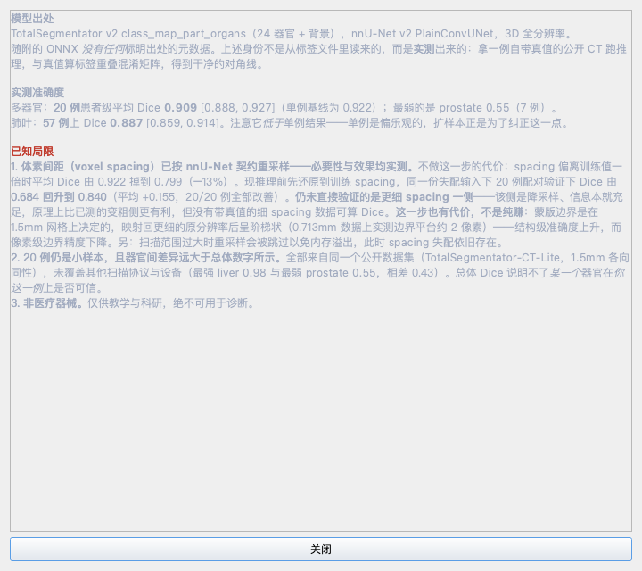

<h1 align="center">医学影像工作站 + 重建实验室</h1>

<p align="center"><strong>一份医学影像算法作品集</strong> —— CT 重建、三维分割，<br>以及决定这两者能不能被相信的那部分测量工作</p>

<p align="center"><a href="README.md">English</a> · <strong>简体中文</strong></p>

<p align="center">
  <a href="https://github.com/sunce764/medical-imaging-workstation/actions/workflows/ci.yml"></a>
  
  
  <a href="LICENSE"></a>
  
</p>

**三维多器官 CT 分割与断层重建**，封装在一个临床式 DICOM 工作站里（PySide6/Qt6，CPU-only）。

- **按第一性原理自行实现**——基于中心切片定理的直接傅里叶重建、解析 Shepp-Logan 模体，以及 DMR / ART / SIRT 迭代求解器。
- **两个网络从零训练**——用于稀疏视角重建的 1.9M 残差 U-Net，与用于肺叶分割的 0.35M 3D U-Net。
- **随软件发布的分割模型来路无任何文档**——其标签方案由本项目实测识别，并在公开真值上验证：21 器官 20 例、肺叶 57 例，抽自一个 297 例的公开数据集。
- **四项量化研究、两项多例验证，以及一次促成产品改动的消融**——重建类研究直接 `import recon`、调用 GUI 用的同一批函数；分割类研究逐步复现 `ai_engine` 的管线，跑的是同一个 `organs.onnx`。

> [!WARNING]
> **仅供教学与科研。** 本软件不是经认证的医疗器械，不得用于临床诊断。AI 分割和器官定量均为自动估计，不构成临床结论。

## 只看一节的话，看这三个结果

**缺陷出在评估，不在模型。** 同一份权重得 **0.490 或 0.746** Dice——唯一变化的是推理张量的尺寸，输入体素一个都没动。`InstanceNorm3d` 逐样本在空间维求统计量；HU 归一化后，空气与补零同为一个值，于是放大张量抹掉了 **99.3%** 的预测前景（225,374 → 1,529 体素）。五条针对性对照，各自排除一种竞争解释——是「针对性」而非「统计独立」：它们跑在重叠的病例与同一份权重上，各自瞄准一个竞争解释。

**一次改动了产品的消融。** 引擎此前静默跳过了 nnU-Net 强制要求的、重采样到训练 spacing 这一步。先测量、后修复：Dice **0.684 → 0.840**，配对 **20 例全部改善**（Wilcoxon *p* = 1.9×10⁻⁶）；本机那条 RIDER 序列上的推理从 **100s / 8.8GB 降到 37s / 3.0GB**——同时更准、也更省。

**一个没能站住的试跑结果。** 加 z 向重叠这件事，3 例试跑曾给出 **+0.205**；全量测试划分——61 例留出，其中 59 例至少含一个在册器官因而可评——只有 **+0.0133**［+0.0072, +0.0194］。两个数字都留在这个仓库里。跑全样本的意义，正在于拦住离群值成为头条。

Python 3.10 · PySide6/Qt6 · **CPU-only，无需 GPU** · 合成模体与公开去标识研究 CT · **仓库不提交 PHI**。

### 作为算法作品集来看？先看这四个文件

| 文件 | 里面是什么 | 支撑产物 |
|---|---|---|
| [`recon.py`](recon.py) | 基于中心切片定理的直接傅里叶重建（含偶数尺寸的半像素修正）、解析 Shepp-Logan 模体，以及 DMR / ART / SIRT 求解器——均按第一性原理自行实现。Radon/FBP 调 scikit-image，下方表格逐项写明哪个是哪个 | [`exp_a_dose_quality.csv`](experiments/results/exp_a_dose_quality.csv)、[`exp_b_filters.csv`](experiments/results/exp_b_filters.csv) |
| [`seg3d_infer_bias.py`](experiments/seg3d_infer_bias.py) | 定位评估缺陷的五条针对性对照（针对不同竞争解释，非统计独立），以及让 59 例配对比较得以放进内存的流式 z 融合 | [`_pad.csv`](experiments/results/seg3d_infer_bias_pad.csv)、[`_norm.csv`](experiments/results/seg3d_infer_bias_norm.csv)、[`_bench_A.csv`](experiments/results/seg3d_infer_bias_bench_A.csv) / [`_bench_B.csv`](experiments/results/seg3d_infer_bias_bench_B.csv) |
| [`seg3d_train.py`](experiments/seg3d_train.py) · [`seg3d_eval.py`](experiments/seg3d_eval.py) | 从零训练的 3D U-Net：患者级划分（`SPLIT_SEED=0` → 207/29/61）、配对评估、bootstrap CI、Wilcoxon | [`seg3d_student_*_zslab.csv`](experiments/results/seg3d_student_ch8d3_33600s_zslab.csv)、[`seg3d_teacher_dice.csv`](experiments/results/seg3d_teacher_dice.csv) |
| [`recon_dl.py`](experiments/recon_dl.py) | 用于稀疏视角重建的 1.9M 残差 U-Net，测的不只是 RMSE，还有虚构结构率与分布外迁移 | [`recon_dl_matrix.csv`](experiments/results/recon_dl_matrix.csv)、[`recon_dl_hallucination.csv`](experiments/results/recon_dl_hallucination.csv)、[`recon_dl_ood.csv`](experiments/results/recon_dl_ood.csv) |

上面多数数字可由已提交的 CSV 重算——但并非全部，故把例外逐个点名而非一笔带过。参数量来自已入库的两个 `.onnx` 计算图；207/29/61 来自 `seg3d_data.split()` 对 manifest 的划分。另有三个成本数字属于**单机实测但未归档**：研究四的 `8.44 / 9.09 GB`，以及本机 RIDER 序列的 `100s / 8.8GB` → `37s / 3.0GB`。它们是实测而非估计，但 `results/` 里没有任何东西能让读者核验。**披露只集中在本段**——上文出现这些数字的地方并未逐处重复该提示。

## 界面

| AI 多器官分割 | 三平面 MPR + 十字线联动 |
|:---:|:---:|
|  |  |

**每一项定量都附带逐体素置信度。** 每个器官行给出模型的 softmax 最大类概率及其 5% 分位——低分位才是关键，因为误差集中在边界。低于 0.9 的条目会标出；下图这一次运行里，胆囊（`conf 0.88 / p5 0.54`）正是模型最没把握的那个，而它恰好也是 spacing 消融独立测出的最脆弱结构。


| 重建实验室（无需任何数据） | 模型说明卡：出处与适用边界 |
|:---:|:---:|
|  |  |

**内置 Shepp-Logan 模体**让整条重建链路在不导入任何数据时就能跑通——V3 是未滤波反投影（糊成一团），V4 是滤波后复现出同一个模体，连最小的病灶都在。模体的真值是解析已知的，因此误差图量的是与真相的距离，而不是与另一次重建的距离。**模型说明卡**写明模型身份是如何被实测推断出来的、验证到了什么程度、还有什么未被测量；卡上每个实测指标都从 `experiments/results/` 现读，重跑实验即自动更新。

> 截图使用 **TotalSegmentator-CT-Lite**（CC-BY-4.0）公开去标识研究数据；本仓库不包含 PHI。模体与说明卡两张则完全不需要数据。

## 核心能力

| 模块 | 能力 |
|---|---|
| **临床阅片** | 解剖排序 DICOM 加载 · 三平面 MPR + 十字线联动 · 6 套窗位预设 + 反色 · 三平面厚层 MIP / MinIP / AIP · 9 个测量和标注工具 · 椭圆 ROI 统计 · 四角 PACS 叠加 · Cine 播放 · 双序列随访对比 |
| **AI 分割** | 25 类后台滑窗 ONNX 推理（含 5 个肺叶）· 三平面彩色叠加与可点图例 · 光标 HUD · 器官统计与 CSV 导出 · marching cubes 三维表面预览、形状特征与 STL 导出 · 画笔/橡皮编辑和撤销 · 逐体素置信度 |
| **重建实验室** | 内置解析 Shepp-Logan 模体 · Radon 投影 · BP / 含 5 种滤波器的 FBP / DFR · 从零实现的 DMR、ART、SIRT · 误差图与 RMSE · 学习式 CNN 后处理，并在界面展示训练视角和输入滤波器限制 |
| **安全与审阅** | 显示层脱敏 · 常驻 AI 免责声明 · 模型说明卡（实测出处及未测边界）· 中英双语界面 |

## 自己实现的，与调用库的

明确写出来，因为「我做了一个 CT 重建实验室」这句话，取决于这个答案，含义天差地别。

| 组件 | 在本项目中的存在方式 | 位置 |
|---|---|---|
| Radon 投影 · BP · 5 种滤波器的 FBP | **调用** —— `skimage.transform.radon` / `iradon` | [`recon.py`](recon.py) |
| 直接傅里叶重建（DFR） | **按第一性原理自行实现** —— 中心切片定理：逐投影 1D FFT、极坐标到直角坐标插值、2D 逆 FFT。含偶数尺寸下的半像素修正，这处是实打实调出来的 | [`recon.py`](recon.py) |
| Shepp-Logan 模体 | **按第一性原理自行实现** —— 十个解析椭圆叠加，而非取自图像库的位图，因而任意分辨率下无插值失真 | [`recon.py`](recon.py) |
| ASD-POCS（TV 正则化迭代重建） | **按第一性原理自行实现** —— 照 Sidky & Pan (2008) §2.4.2 伪码，参数取文献值；TV 梯度在测试套件中与有限差分对拍 | [`recon.py`](recon.py) |
| 系统矩阵 · DMR · ART · SIRT | **按第一性原理自行实现** —— 逐像素构建系统矩阵并缓存；ART 为 Kaczmarz 逐射线更新，行范数预计算 | [`recon.py`](recon.py) |
| 稀疏视角重建 CNN（1.9M） | **从零训练**，PyTorch。模体数据始终有种子；训练侧 RNG 是在这批结果产出*之后*才固定的 | [`recon_dl.py`](experiments/recon_dl.py) |
| 肺叶分割 3D U-Net（0.35M） | **从零训练**，患者级划分，种子固定 | [`seg3d_train.py`](experiments/seg3d_train.py) |
| 25 类器官分割 | **第三方权重**（TotalSegmentator v2）。溯源识别、标签映射实测、20 例与 57 例验证是本项目的工作；网络本身不是 | [`ai_engine.py`](ai_engine.py) |
| DICOM 读写 · MPR 几何 · 定量 · 配准 | **本项目编写**，构建在 `pydicom` / `numpy` / `scipy` 之上 | [`main.py`](main.py)、[`mpr_geometry.py`](mpr_geometry.py)、[`quantify.py`](quantify.py) |

## 快速开始

```bash
conda env create -f environment.yml     # 创建 Python 3.10 环境
conda activate dicom_gui
python main.py                           # 空载启动
python main.py --data /path/to/dicom_dir # 或启动时加载 DICOM 目录
```

- **CPU-only，无需 GPU。** 在参考机器上，本机那条 RIDER 序列（**不随仓库分发**，见下方数据说明）的整卷 AI 推理约需 **37 秒、峰值约 3.0GB**。证据表里的 **100s / 8.8GB** 是*修复前*的数字——spacing 消融把 nnU-Net 的重采样步骤补了回去，推理因此同时更准也更省。
- **复现研究所需的依赖多于运行 App。** `environment.yml` 装的是工作站本身运行所需；实验另需 torch / matplotlib / nibabel / onnx / remotezip，锁版见 [`experiments/requirements-experiments.txt`](experiments/requirements-experiments.txt)。
- **两份权重属于 `artifact not distributed`**，都无法由一次普通 `git clone` 得到。两者的 SHA-256 已记入 [`models/CHECKSUMS.sha256`](models/CHECKSUMS.sha256)，同时收录研究三、四训练出的 6 个 PyTorch checkpoint。该文件写明这些摘要能证明什么、不能证明什么——它能让你核对另处取得的文件是否同一份，但摘要是**现在**取的、不是结果产出时取的，因此**不是**追溯性的溯源记录。关于来源**哪些从未被记录**，见 [架构 → 获取权重](docs/ARCHITECTURE.md#getting-the-weights)：
  - `models/organs.onnx.data`（119 MB）—— 第三方 TotalSegmentator v2 权重。不在此转载：本仓库的 `LICENSE` 是仅供审阅的专有许可，把 119 MB 的上游产物置于其下会模糊 [`THIRD_PARTY_NOTICES.md`](THIRD_PARTY_NOTICES.md) 划定的许可边界。重建方式见[架构说明 → 获取权重](docs/ARCHITECTURE.md#getting-the-weights)。缺失时分割自动降级为经典连通域算法，GUI 照常运行。
  - `models/recon_dl_v20.onnx.data`（7.4 MB）—— 本项目自训，供研究三的学习式重建使用。不入库；重建需**两**步：`python experiments/recon_dl.py matrix` 训练并写出 `.pt`，再 `python experiments/recon_dl.py export` 转成 ONNX 外部权重。**重建结果从未与已提交产物做过比对**，因此不对二者有多接近作任何声称。模体生成一直有种子；PyTorch 侧的 RNG 此前没有，直到 `train_one` 加入 `torch.manual_seed(seed)`——那是一处只约束*今后*运行的前瞻性修复，晚于研究三的每一份已提交结果。缺失时重建实验室照常运行，只是 CNN 后处理那一视图不可用。
  - 两个 `.onnx` 计算图（44 KB 与 20 KB）**已入库**，所以即使没有权重，网络结构本身也是可查的——上文那两个参数量 31.2M 与 1.9M，正是从这两个文件重算出来的。

## 量化证据

实验测量的是随软件发布的那条管线，但直接程度分两档：重建类直接 `import recon`、调用 GUI 自己的函数；分割类逐步复现 `ai_engine` 的预处理与滑窗推理，跑的是同一个 `organs.onnx`。研究 IV 的学生模型是另训的独立模型，其产品线测量同样是复现产品推理路径，而非调用它。研究 I–III 与 spacing 消融见[技术报告](docs/technical_report.md)；**研究 IV 晚于该报告**，连同全部脚本与已提交结果一并收在 [`experiments/`](experiments/README.md)。

| 证据线 | 实测结果 | 适用边界 |
|---|---|---|
| **研究 I —— 重建剂量-质量** | 误差在 ≈180 视角后趋平——**实测表明那是重建链路自身的离散化地板（圆内 RMSE ≈0.03539;720/1440/2880 视角三者相差 0.02% 以内且不再下降），不是剂量结论**；最优 FBP 滤波器从稀疏角的平滑滤波切换为稠密角的锐利 Ram-Lak。**「ART 最鲁棒」这一结论已撤回**：它出自 1:20 的算力失衡（5 轮对 100 轮），各自取最优时 SIRT 在每一档剂量都优 9–20%。后续对同一批系统矩阵做 SVD 来检验本研究自己对最小二乘失稳的解释，结果**要改的是工具而非结论**：2-范数条件数对其中两个系统根本无定义，但最小二乘实际求逆的那部分谱上的噪声增益，恰在近方阵处取 23–37 倍的尖峰。替代说法刻意只做定性——不声称对该尖峰的任何定量归因。后续另补上了方法集里缺的一块：原先没有 TV 正则化基线，而它是稀疏角重建的标准对照。**ASD-POCS 在本研究的噪声水平下把最优求解器的误差再减半（相对 SIRT 自身最优点 +45–56%），而到 η≈9% 时反过来输**——可报告的结论是这条信噪比依赖关系，不是那个头条数字；另跑了一个刻意与 TV 先验作对的模体来试图推翻它，没能推翻。 | 解析二维 Shepp-Logan 模体；矩阵法限制在 ≈64×64；ART/SIRT 迭代次数固定、未逐剂量调优。[预印本稿](docs/preprint_recon.md) · [条件数 CSV](experiments/results/exp_c_conditioning.csv) |
| **研究 II —— 模型出处与 Dice** | 标签重叠混淆矩阵实测出未文档化模型的标签方案即 TotalSegmentator v2 `class_map_part_organs`——21 个在场器官呈身份对角线——并纠正两处标签错误。被实测的是**标签映射**；由此推断这份权重就是那个上游 release，是很强的推断，但不是密码学意义上的证明。**20 例**患者级平均 Dice **0.909**（95% CI [0.889, 0.927]），单例 0.922 略偏乐观但落在区间内。 | 器官间可靠性差异远大于总体数字所示：肝 0.982、脾 0.976，而右肺上叶 0.773、前列腺 0.554（仅 7 例在场）。[`seg_multi.py`](experiments/seg_multi.py) |
| **研究 III —— 学习式稀疏角重建** | 自实现 1.9M 参数残差 U-Net 将 RMSE 降低 **3–6 倍**，病灶对比度保留率从 0.87 提升至 **0.96–1.00**；虚假结构率为 1.7%，分布外增益比为 0.81。 | 使用无噪声合成投影；幻觉率是有利条件下的下界，不能外推至光子饥饿的低剂量 CT。 |
| **研究 IV —— 压缩分割模型，以及它暴露出的评估缺陷** | 从零训练的 0.35M 3D U-Net，对照随软件发布的 31.2M 教师。给它打分时暴露出问题出在**评估**而非模型——同一份权重仅因张量尺寸不同即得 **0.490 或 0.746**（见上表）。把同样的怀疑用到产品推理路径上，配对覆盖全部 24 器官、**test 集 61 例中的 59 例**，得到全器官 Dice **+0.0133**［+0.0072, +0.0194］，**59 例中 54 例改善**，代价 1.18× 耗时与 +0.65GB。 | 五条针对性对照各自排除一种竞争解释（针对不同竞争解释，非统计独立）；3 例试跑曾给出的 **+0.205** 没能挺过全样本。在留出的 test 集上、以**同一条推理路径**相比，学生比教师低 **0.4500**［-0.4877, -0.4118］（234 个叶次）——0.35M 在此并未逼近 31.2M。两条推理路径混用，在同一份权重上值 0.33 Dice，故报告脚本拒绝把它们画进同一张图。[`seg3d_infer_bias.py`](experiments/seg3d_infer_bias.py) · [完整记述](experiments/README.md) |
| **消融 —— spacing 契约** | 引擎此前跳过了 nnU-Net 必需的「重采样到训练 spacing」。先测代价（spacing 偏离一倍时平均 Dice 由 0.9219 掉到 0.7995，小器官最先垮且非单调），再据此实现。**20 例配对**下同一份失配输入由 **0.684 回升到 0.840**，**20/20 例全部改善**（Wilcoxon *p* = 1.9×10⁻⁶）；同一条本机序列的推理由 100s / 8.8GB 降至 **37s / 3.0GB**。 | 32GB 机器只测得到变粗方向，更细一侧是据「属降采样」推断而非实测。蒙版边界现按 1.5mm 网格量化——结构级准确度升、像素级边界精度降。[`seg_spacing.py`](experiments/seg_spacing.py) |
| **扩展验证 —— 肺叶** | 57 例公开 CT 的五肺叶平均 Dice 为 **0.8867**（95% CI **[0.859, 0.914]**）；右肺上叶为 0.727，而原单例为 0.967。 | 只验证五个肺叶。该结论被独立印证：另一次 20 例运行用不同脚本、不同抽样，把同一个右肺上叶测为 0.773。[`seg3d_teacher.py`](experiments/seg3d_teacher.py) |

## 在真实约束下把它跑起来

三维医学影像里，内存和 I/O 远在模型质量之前就成为约束。下面每一条都始于实测到的症状，而非设计偏好。

**流式 z 融合 —— 峰值内存由 O(Z) 降到 O(块高)。** 带重叠的推理必须把 25 类 logits 沿整卷累加；对最大的一例（273×430×430），仅这个数组就要 **5.17GB**，再加上已载入的 ONNX session，正好撞上此前否决 `DZ=64` 的那堵 14.3GB 的墙。但在块高 32、步长 24 的配置下，任一 z 位置*通常*最多被两个块覆盖，于是整卷累加器可以换成一小段近期块的历史。难点在边界：末块要贴住卷尾，与前一块的间隔可能小于步长，此时某些 z 会被**三个**块覆盖。「最多两块」正是当初必须放弃的那个假设——实现保留最近**两个块的原始 logits**，且保持**未融合**。改写后**与全量累加版逐体素对拍**，而这道对拍立刻就回本了：它抓出一个真实缺陷——融合结果被写回同一个数组后才存入缓存，导致上上个块的贡献被重复计入。四例中有三例照样一致，只有末尾两块仅隔 2 层的 `s0347` 把它暴露出来。最终结果：带重叠的配置峰值 **9.09GB，而完全不需要累加的配置是 8.44GB**。

**一个 98% 时间在空转的训练循环。** 第一个 epoch 跑了四分钟没有结束，CPU 占用 **1.6%**——全部时间在等 I/O。207 例训练集对上进程内 8 例的缓存，命中率 3.9%，于是几乎每次采样都要重读、解压并重新归一化一个 18MB 的 `.nii.gz`。预处理成 `float16`/`uint8` 的 `.npy` 并改用 `memmap` 采样后，每次读取降到约等于 patch 本身（~1MB），与体积大小无关。值得写明它为何没被发现：冒烟测试用的是 70 例、5 个 step，这个配置下问题根本不会出现。

**用内存换精度，并标明价码。** 给产品推理路径加上 25% 的 z 重叠，值 **+0.0133** 的全器官 Dice（95%CI［+0.0072, +0.0194］），代价是 1.18× 耗时与 **+0.65GB**。改为提高块高则要 14.3GB，且并无实测收益。两半都写出来是有意的——报了优化不报代价，那不算结果。

## 工程与测试

- 原 God-object 已拆分为 **5 个 UI mixin + 9 个无 Qt 计算模块**。
- 作者机器上全套 **609 项检查**，`SKIP_REAL_DATA=1` 可达 **519 项**。**干净的 CI runner 会更少——当前为 500 项**。差值不是不稳定，而是那些需要「干净 clone 拿不到的产物」（未分发的 `.onnx.data` 权重与 `.pt` checkpoint）的检查在那里根本不会执行。500 这个数是**方法已被校准的预测**而非估计：在一份全新 clone 里跑 `SKIP_REAL_DATA=1` 能精确复现 CI 计数——在提交 `7a09744` 处该 clone 给出 **458**，正是 [CI 当时实际记录的数字](https://github.com/sunce764/medical-imaging-workstation/actions/runs/32590281440)。最终仍以 run 日志为准，此处给的是该方法对下一次 run 的预测。留在 CI 之外的是需要 RIDER 序列或那些权重的部分——**不是**交互层，交互层由合成 DICOM 与合成鼠标/滚轮事件在 CI 中覆盖。
- 重建算法测试断言数值正确性，而非只检查输出“有限”；DICOM 读取对畸形元数据作防御处理。

```bash
python tests/test_gui.py                     # 完整回归：本地 609 项；需本地 RIDER 数据
SKIP_REAL_DATA=1 python tests/test_gui.py    # 本地 519 项；干净 CI runner 500 项（见上）
ruff check .                                 # 静态检查
coverage run tests/test_gui.py && coverage report
```

<details>
<summary><strong>覆盖率详情</strong></summary>

离屏 Qt 覆盖率 **90%**（3359 条语句）。九个无 Qt 模块（`recon` 86%、`quantify` 100%、`segmentation` 92%、`mpr_geometry` 96%、`followup` 90%、`projection` 95%、`mesh3d` 96%、`registration` 98%、`model_card` 87%）均有独立单测；合成鼠标 press/move/release 序列会断言信号载荷（`graphics_view` 91%）。此前无人走过的几层提升明显：重建实验室 UI 调度 `recon_lab` 44% → **89%**，标注/分割编辑 `annotation_lab` 74% → **83%**，鼠标交互调度 `interaction.py` 64% → **98%**、随访对比 `compare_lab` 82% → **95%**。写这些断言的过程挖出三个只读代码发现不了的缺陷：光标移出体积后探针仍显示上一次的读数、模型说明卡遇到截断的 CSV 会崩、数字 id 的标注永远渲染不出也删不掉。因此，CI 全绿只代表数据无关子集通过，不等于所有本地数据交互测试均已运行。

</details>

## 文档

| 文档 | 语言 | 用途 |
|---|---|---|
| [架构说明](docs/ARCHITECTURE.md) | 英文 | 模块图、God-object 分解、分割模型出处和 AI 管线契约 |
| [一个未被满足的推理契约](docs/spacing_contract.md) | 中文 | 一次完整的工程判断：发现产品违背模型前提、量化代价、修复、多例验证、声明未测边界 |
| [软件说明书](docs/manual_zh.md) · [English](docs/manual_en.md) · [PDF](docs/manual_zh.pdf) | 中文 · EN | 按界面截图讲解全部用户功能。**打开 PDF 前请先看这条勘误：** 该文件是随软著登记提交的 V1.0 冻结快照，登记在审期间有意不作改动，因此封面仍把截图数据写作「非患者数据」。这是错的——TotalSegmentator-CT-Lite 是公开、已去标识的**人体** CT，影像来自真实患者，只是不含可识别 PHI。两个 Markdown 版本已是更正后的措辞。 |
| [技术报告](docs/technical_report.md) | 英文 | 研究 I–III 的方法、图表与结果 |
| [预印本稿 —— 研究 I](docs/preprint_recon.md) | 英文 | 学术格式的稀疏视角 / 低剂量重建研究 |
| [实验](experiments/README.md) | 英文 | 实验脚本、图表、已入库产物，以及逐研究各不相同的可复现限度 |
| [变更记录](CHANGELOG.md) | 英文 | 可审计的缺陷修复与审查记录 |
| [第三方许可](THIRD_PARTY_NOTICES.md) | 英文 | 已对上游核实的集成组件许可 |

## 安全边界与已知限制

- **非临床器械：**无监管认证、临床验证档案、审计追踪或访问控制。
- **仅做显示层脱敏：**屏幕与导出文件名会隐藏 PHI，但不会清洗底层 DICOM 标签和烧录文字。
- **AI 泛化仍有未测部分：**肺叶验证 57 例、21 器官验证 20 例，样本量仍小，且全部来自同一个公开数据集（1.5mm 各向同性）；其他扫描协议与设备未经测试，器官间可靠性的差异远大于总体数字（肝 0.98 vs 前列腺 0.55）。spacing 重采样已接入（见证据表），但更细一侧仍属推断而非实测，且扫描范围过大时会被跳过。
- **重建限于教学范围：**DMR / ART / ASD-POCS 矩阵重建受最小二乘成本限制，实用上限约 64×64。研究 III 使用无噪声合成投影，不能证明低剂量临床表现。
- **随访为刚性而非形变配准：**平面内配准在测试中将整体平移造成的 MAE 从 321 HU 降至 13 HU，但不会校正呼吸引起的器官形变；差异结果只能作定性参考，不能视为临床变化量。

## 许可与版权

© 2026 **盛超（Sheng Chao）、赖胜圣（Lai Shengsheng）**。保留所有权利。

本软件由上述两位著作权人共同享有权利，已向中国版权保护中心提交列明双方的计算机软件著作权登记申请，目前待受理。

**该申请覆盖的范围，精确到文件。** 提交的材料是 **2026-07-08** 的快照，包含 [`docs/build_source_pdf.py`](docs/build_source_pdf.py) 所列的十三个产品模块：`main.py`、`ui_builder.py`、`interaction.py`、`recon_lab.py`、`compare_lab.py`、`annotation_lab.py`、`ai_engine.py`、`graphics_view.py`、`recon.py`、`quantify.py`、`segmentation.py`、`mpr_geometry.py`、`constants.py`。两点与其让人猜，不如写明：

- **当前代码已领先于该快照**，且是有意为之——登记以提交的材料为准，故快照冻结、产品继续演进。此处不主张当前代码**就是**提交的那份快照——也不主张该申请已获登记；目前的状态是已提交、待受理。
- **`experiments/` 不在登记范围内。** 这些研究是用来度量产品的代码，从未纳入申请，其结论也不在登记覆盖之列。

本仓库仅供教学、科研与作品集审阅，**未授予任何复制、修改或再分发许可**；如需使用，请联系著作权人。集成的第三方组件依其各自许可，详见 [`THIRD_PARTY_NOTICES.md`](THIRD_PARTY_NOTICES.md)。
