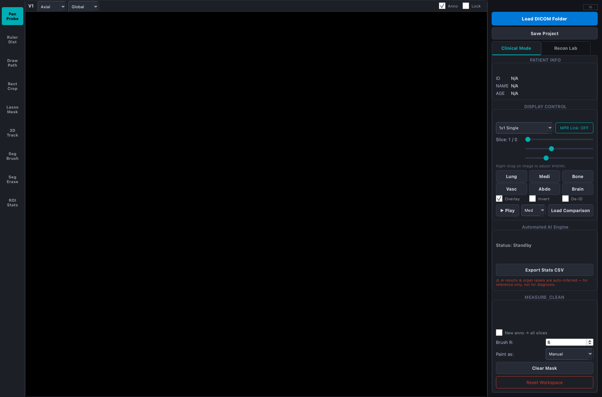
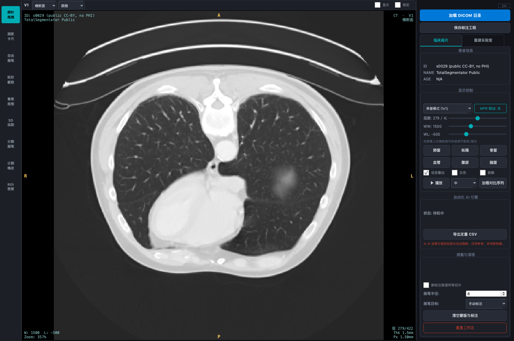
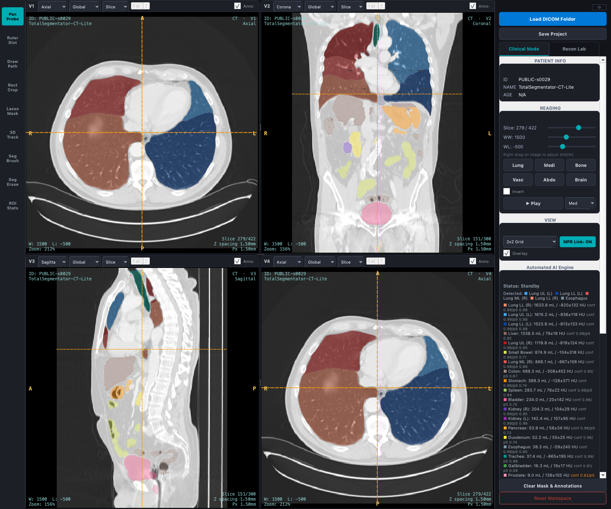
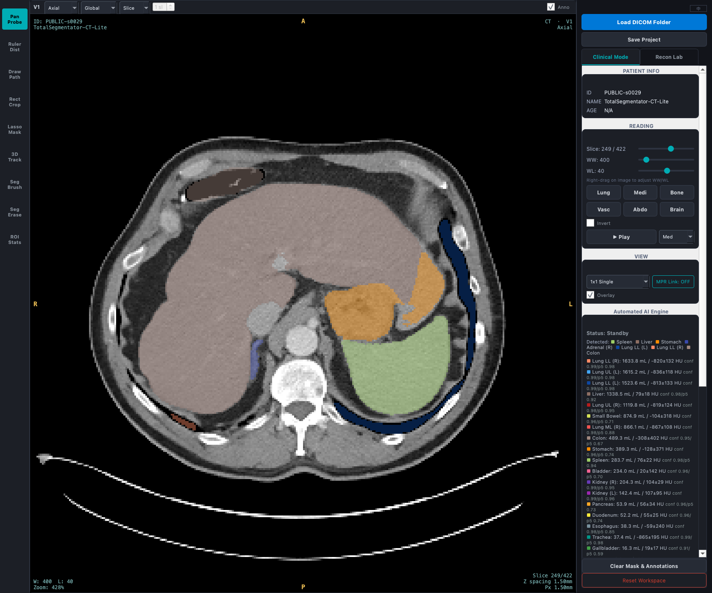
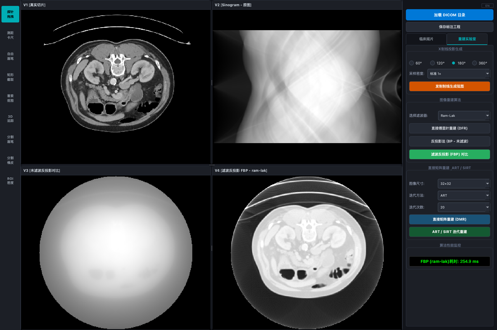
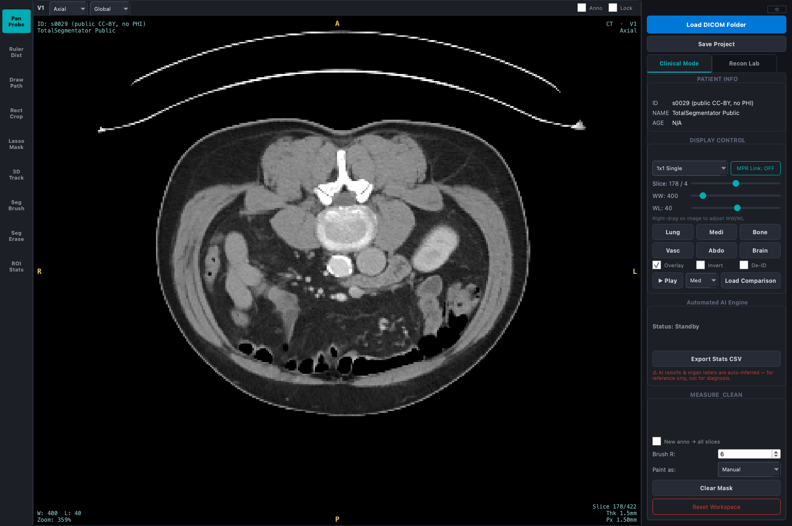

# 医学影像工作站软件 · 软件说明书

[English](manual_en.md) · **简体中文**

> 本说明书随软件版本 V1.0 编写。文中截图均使用**公开数据集 TotalSegmentator-CT-Lite（CC-BY-4.0）**演示，**非患者数据、不含个人隐私信息（PHI）**，患者信息栏已明确标注为公开数据。

---

## 一、软件概述

**软件名称**：医学影像工作站软件（Medical Imaging Workstation Software）
**软件版本**：V1.0
**软件简介**：本软件是一款基于 PySide6（Qt6）的桌面端 CT 医学影像工作站，面向影像教学与科研，集成三大部分——**临床阅片工具**、**AI 多器官分割**、以及**CT 断层重建教学实验室**。软件支持 DICOM 影像的加载、多平面重组（MPR）阅片、窗宽窗位调节、测量与标注、AI 自动器官分割与定量、双序列随访对比，以及从投影到重建的完整教学演示。
**运行环境**：Windows / macOS / Linux 桌面系统，Python 3.10；依赖 PySide6、pydicom、NumPy、SciPy、scikit-image、ONNX Runtime。
**开发语言**：Python。
**软件规模**：应用代码约 4,100 行，划分为 13 个模块；配套 296 项自动化回归测试。
**定位声明**：本软件为**影像教学 / 科研工具**，**不是经认证的医疗器械，不得用于临床诊断**；AI 分割与定量结果为自动推断，仅供参考。

---

## 二、运行环境与启动

在配置好依赖的 Python 环境中，于软件根目录执行：

```
python main.py                          # 空载启动（不加载任何数据）
python main.py --data <DICOM目录路径>    # 启动即加载指定 DICOM 目录
```

软件启动后进入主界面。默认**不加载任何数据**，等待用户从界面加载，界面如下图所示。



*图 2-1　空载启动界面（英文界面示例）。左侧为工具栏，中部为影像视图区，右侧为控制面板。*

---

## 三、主界面布局

主界面分为三栏：

1. **左侧工具栏**：自上而下排列 9 个测量/标注工具按钮（探针拖拽、测距卡尺、自由画笔、矩形截取、套索抠图、3D 追踪、分割画笔、分割橡皮、ROI 密度）。单击选中某工具后，在影像上的鼠标操作即对应该工具的功能。
2. **中部影像视图区**：由 1～4 个影像视图组成，支持单窗、双窗、四窗三种布局。每个视图顶部有平面选择（横断/冠状/矢状）、窗位预设、显示叠加、锁定等下拉/复选控件。
3. **右侧控制面板**：顶部为「加载 DICOM 目录」「保存标注工程」按钮，其下为「临床阅片 / 重建实验室」两个标签页，分别承载临床阅片控制与重建实验室控制。

顶部标签页在**临床阅片**与**重建实验室**两种工作模式间切换。

---

## 四、DICOM 数据加载

单击右侧面板顶部的**「加载 DICOM 目录」**按钮，在弹出的文件夹选择对话框中选择包含 DICOM 切片的目录，软件将：

- **并行读盘**：多线程读取目录内全部 DICOM 文件，加速大序列加载；
- **多序列处理**：若目录含多个序列，自动选取切片数最多的序列，并按切片矩阵尺寸过滤，避免混叠；
- **解剖排序**：优先按 `ImagePositionPatient`（床位 Z 坐标）排序，缺失时回退按 `InstanceNumber` 排序，保证解剖层面顺序正确；
- **构建三维体数据**：按 DICOM 标准 `HU = 像素值 × RescaleSlope + RescaleIntercept` 逐层转换为 HU 值三维数组；
- 加载完成后自动跳转到中间层，并在后台启动 AI 分割推理（见第七节）。

---

## 五、临床阅片

### 5.1 切片浏览与导航

右侧面板「切片」滑条可逐层浏览；也可将鼠标移入影像用滚轮翻层。键盘 `↑ / ↓`、`PgUp / PgDn` 亦可翻片。

### 5.2 窗宽窗位调节

右侧「显示控制」区提供 **WW（窗宽）/ WL（窗位）** 两条滑条，以及 6 套临床窗位预设按钮：**肺窗、纵隔、骨窗、血管、腹部、脑窗**；另有**反色**复选。也可在影像上按住鼠标右键拖拽，实时调节窗宽窗位。下图为切换到**肺窗**、显示胸部横断层的效果。



*图 5-1　肺窗下的胸部横断面阅片。四角叠加显示患者信息（公开数据）、窗位、切片号与解剖方位字母（A/P/R/L）。*

### 5.3 MPR 三平面与十字线联动

启用「MPR 联动」后，可在四窗布局中同时显示**横断（Axial）、冠状（Coronal）、矢状（Sagittal）** 三个平面。在任一视图移动鼠标，其余视图的十字准线与切片随之联动到同一解剖点；各向异性平面（冠/矢状）按解剖比例自动校正显示纵横比。



*图 5-2　三平面 MPR + 十字线联动（肺窗，AI 肺叶彩色叠加显示于横断视图）。*

### 5.4 布局模式

右侧「显示控制」的布局下拉可在**单窗（1×1）/ 双窗（1×2）/ 四窗（2×2）** 间切换。

### 5.5 DICOM 四角信息叠加

「信息叠加」复选开启后，影像四角以 PACS 风格叠加显示患者信息、窗宽窗位、切片号，并在图像边缘标注解剖方位字母（A 前 / P 后 / R 右 / L 左 / S 头 / I 足）。

### 5.6 Cine 电影播放与键盘翻片

「播放」按钮开始 Cine 电影播放，自动连续翻片（到顶/到底往返，不跳变回环）；速度下拉可选慢/中/快；再次单击暂停。

### 5.7 厚层投影（MIP / MinIP / AIP）

每个视图顶部的投影下拉可在四种模式间切换，右侧数字框设定层块厚度（层数）：

| 模式 | 含义 | 典型用途 |
|---|---|---|
| **单层** | 默认，显示单一切片 | 常规阅片 |
| **MIP** | 最大密度投影 | 肺结节、血管、骨等**高密度**结构 |
| **MinIP** | 最小密度投影 | 气道、肺气肿区等**低密度**结构 |
| **AIP** | 平均密度投影 | 降噪、观察整体密度分布 |

投影沿当前平面的法向进行，**三个平面均支持**。选择「单层」时厚度框自动禁用，此时显示结果与不使用投影功能时**逐像素完全一致**。

> 为何是厚层而非整卷投影：临床上使用的是 slab MIP（典型 5–20mm），把整个体积压成一张图会把无关解剖结构一并叠上来，反而掩盖目标。厚度换算为毫米时按平面区分——横断面沿 z 用层厚，冠/矢状面沿平面内轴用像素间距，两者物理尺度不同。

---

## 六、测量与标注工具

左侧工具栏 9 个工具，选中后在横断面影像上操作：

1. **探针拖拽**：单击读取该点 HU 值与坐标；拖动平移视图。
2. **测距卡尺**：拖出直线测量两点间物理距离（mm，按像素间距换算）。
3. **自由画笔**：在影像上自由绘制标注线。
4. **矩形截取**：框选矩形 ROI，统计区域面积与平均 HU，可选导出裁剪图与 CSV。
5. **套索抠图**：绘制多边形 ROI 生成分割蒙版。
6. **3D 追踪**：在某层框选 ROI，提取其 HU 统计特征，在整个三维体积中追踪 HU 相似的连通结构，生成三维蒙版。
7. **分割画笔**：在当前横断层涂画，将笔迹补入分割蒙版（可选目标器官，补画计入该器官定量），用于修正 AI 遗漏。
8. **分割橡皮**：擦除涂过处的蒙版（可清除 AI 误分割）。
9. **ROI 密度**：拖出椭圆 ROI，读取内部 均值 ± 标准差 / 最值 HU / 面积；椭圆可拖动、缩放、删除。

标注支持**切片专属**与**全局穿透**两种归属，并可通过「保存标注工程」将标注与分割蒙版以工程 JSON 持久化保存。分割编辑支持 `Ctrl+Z` 撤销。

---

## 七、AI 多器官分割

### 7.1 自动推理

加载 DICOM 数据后，软件自动在后台线程调用分割模型（`models/organs.onnx`，25 类胸腹器官含 5 个肺叶）进行整卷滑窗推理，右侧「自动化 AI 引擎」区实时显示推理进度；推理不阻塞界面操作。无模型文件或推理失败时，自动降级为纯数学连通域肺分割算法；**若降级算法也失败**，状态栏以红色明确标注「AI 分割失败」并提示详情见控制台——不会停留在「运算中」让用户空等，也不会显示成「检出 0 个器官」（那是跑成功但没找到，与失败是两回事）。此时测量、标注、重建实验室等其余功能均不受影响。

### 7.2 结果叠加与图例

推理完成后，分割结果以彩色半透明蒙版叠加于影像，**横断、冠状、矢状三个平面均可显示**（蒙版与影像取自同一三维数组的对应切片，逐像素对齐）；右侧图例列出检出的各器官及其颜色，**单击图例可切换该器官显隐**。



*图 7-1　AI 多器官分割结果叠加（肝、脾、肾、胃、肺叶等），右侧图例含各器官体积/HU 与免责声明。*

### 7.3 光标 HUD

鼠标在影像上移动时，界面实时显示光标处的坐标、HU 值，以及所在器官名称（若该体素属于某分割器官）。

### 7.4 器官定量面板与 CSV 导出

「自动化 AI 引擎」区列出各检出器官的**体积（mL）与平均 HU ± 标准差**（按体积降序）。单击**「导出定量 CSV」** 可将定量结果导出为 CSV 文件（UTF-8-SIG 编码，便于 Excel 正确显示中文），除体积与均值外另含**标准差、中位数、第 5/95 百分位、最小值与最大值**共七项 HU 统计量；CSV 内嵌 AI 免责声明。

> 为何不只给均值：仅有均值无法反映器官内部的密度离散程度，而离散度是判断分割是否误纳入邻近组织、以及做任何统计比较的前提。第 5/95 百分位比最值更抗单体素噪声。

### 7.5 三维表面重建

单击**「三维重建预览」**，软件对**当前画笔目标所选器官**重建三维表面，弹窗显示可**按住鼠标拖动旋转**的三维视图，并给出**表面积、体积、球形度与面片数**；可进一步**导出 STL**（ASCII 格式，单位 mm，供 3D 打印或外部软件打开）。

**交互操作**：在图上按住左键拖动即可旋转——横向改方位角、纵向改俯仰角（0.5°/px）；右侧「前 / 后 / 左 / 右 / 上 / 斜」六个按钮可一键跳到标准视角；当前角度实时显示在图下方。俯仰角夹在 ±89°，以避开视线与旋转轴共线时（万向节锁）方位角失去意义、画面突然翻转的问题。

重建流程为 **等值面提取（marching cubes）→ Taubin 平滑 → 顶点聚类减面**，与 3D Slicer 的表面模型工作流一致。渲染为纯计算实现（正交投影 + Lambert 着色 + 画家算法深度排序），不依赖 OpenGL 或 VTK，故无需 GPU；代价是没有透视与阴影。

> **旋转如何做到跟手**：完整网格渲染一帧约 114 ms（实测，360px 视图、4,615 面），直接用它响应鼠标会明显顿挫。故采用**拖动降质、松手提质**：拖动过程改用再减一档的粗网格（真实器官实测 6,798 → 1,984 面，约 48 ms/帧），松开鼠标立刻用完整网格重渲染一帧——**静止时看到的始终是全精度画面**。粗网格仅影响拖动中的显示，**形状特征与 STL 导出一律使用完整网格**（粗网格体积偏差实测 1.6%，若用于定量会污染结果）。

> **为何要平滑**：只做 marching cubes 会留下体素阶梯，表面积随之高估。以解析球体（R=20、spacing=1mm）实测：未平滑时表面积高估 **+9.3%**、球形度 0.915；经 10 次 Taubin 平滑后降至 **+1.2%**、球形度 0.988，而**体积仅变动 +0.08%**。Taubin 用正负交替的两步抵消收缩，故能去阶梯而基本保体积——若换成纯 Laplacian 平滑，网格会持续缩水、污染体积定量。减面（默认减至约一半面数）使渲染耗时减半，体积误差在 0.1% 量级。

### 7.6 分割编辑

选用「分割画笔 / 分割橡皮」工具，可对 AI 分割结果手动补画或擦除；补画可指定目标器官（其定量随之更新）。所有编辑支持 `Ctrl+Z` 撤销。

---

## 八、双序列随访对比

单击右侧**「加载对比序列」** 按钮，选择既往检查的 DICOM 目录，软件进入双窗对比模式：左窗（V1）为当前序列，右窗（V2）为既往序列。两序列**按 `ImagePositionPatient` 解剖 Z 坐标配准**（同一解剖层面并排显示），切片与窗位联动；缺位置信息时回退按索引比例映射。再次单击**「退出对比」** 返回。脱敏开启时，对比标题中的既往检查日期会被隐去。

### 8.1 差异定量

配准后，V2 标题栏实时给出当前层的 HU 差异定量：**Δ均值**（当前 − 既往，正值表示当前更致密）、**平均绝对差**与 **RMSE**。切换到四窗布局时，V3 另显示**差值图**：暖色表示密度升高、冷色表示降低、零差异处透明。

两序列矩阵尺寸不同时，软件**如实标注「不可比」而不做强行缩放**——插值会引入误差并制造「看起来能比」的假象。

### 8.2 平面内刚性配准

顶部工具栏的**「配准」**复选框（**仅在对比模式下可用**，未加载对比序列时为禁用态）会在比较前，先把既往层刚性配准到当前层：用**相位相关**估计平移、再在 ±6° 内以 0.5° 步长搜索旋转，取归一化互相关（NCC）最高者。标题栏实时显示估计出的角度、平移与 NCC 变化。

- **安全阀**：若配准后 NCC 不升反降（层面不对应、解剖变化过大等），软件**拒绝采用**该变换并标注「配准未采用」——宁可不配准，也不能把图对得更歪。
- **实测效果**：对整体平移 (12, −9) 的既往序列，平均绝对差从 **321 HU 降至 13 HU**，NCC 0.85 → 0.99。

> **重要限制**：刚性配准只校正**体位**（平移+旋转），**不做形变配准**，故呼吸导致的器官形变不会被校正。选择刚性而非形变配准是有意的——形变配准能吸收呼吸形变，但也会把**真实的病灶变化**一并「配没了」，对以观察变化为目的的随访比较是有害的。因此所报差异**仍只宜作定性参考，不是临床意义上的病灶变化量**。此外，既往序列不做 AI 推理，故**不提供器官级体积变化**。

---

## 九、重建实验室（CT 断层重建教学）

单击顶部标签页切换到**「重建实验室」**。本模块以当前切片为对象，完整演示从 X 射线投影到图像重建的过程。其中正向 Radon 投影与解析反投影（BP / FBP）基于 scikit-image 的 `radon`/`iradon`；DFR、DMR、ART、SIRT 四种反解算法为本项目纯计算实现。



*图 9-1　重建实验室四窗视图：V1 真实切片、V2 投影弦图（Sinogram）、V3 未滤波反投影（模糊）、V4 滤波反投影 FBP（锐利）；右侧为投影/算法控制与性能监控。*

### 9.1 投影生成（Radon 变换）

右侧「X 射线投影生成」区选择**角度范围（60° / 120° / 180° / 360°）** 与**采样密度（标准 1× / 高 2× / 超高 4×）**，单击**「发射射线生成弦图」**，对当前切片做 Radon 变换生成投影弦图（Sinogram），显示于 V2。

### 9.2 解析重建

「图像重建算法」区提供：

- **直接傅里叶重建（DFR）**：基于傅里叶中心切片定理，由弦图直接重建；
- **反投影法（BP，未滤波）**：纯反投影，结果模糊（星形伪影），显示于 V3 用于对比；
- **滤波反投影（FBP）**：可选 5 种滤波器（Ram-Lak / Shepp-Logan / Cosine / Hamming / Hann），结果显示于 V4。

### 9.3 矩阵 / 迭代重建

「直接矩阵重建 & ART / SIRT」区选择**图像尺寸（16/32/64）**、**迭代方法（ART / SIRT）**、**迭代次数**，提供：

- **直接矩阵重建（DMR）**：以最小二乘法求解投影方程组；
- **ART / SIRT 迭代重建**：代数迭代重建，附误差图与 RMSE。

### 9.4 性能监控

「算法性能监控」区实时显示各重建算法的运行耗时（如图 9-1 中「FBP (ram-lak) 耗时: 254.9 ms」）。

---

## 十、合规与脱敏

- **脱敏开关**：右侧「显示控制」的「脱敏（De-ID）」复选开启后，一键隐去屏幕显示与导出文件名中的患者身份信息（显示层脱敏）。
- **AI 免责声明**：AI 面板常驻显示免责声明，导出的定量 CSV 亦内嵌该声明。

---

## 十一、中英双语切换

界面右上角语言按钮可一键在**中文 / 英文**之间切换，全部常驻控件文字（工具、按钮、面板标题、下拉项、悬停提示、状态文案等）随之重译。下图为英文界面示例。



*图 11-1　英文界面（纵隔窗，腹部横断层）。*

---

## 十二、标注工程持久化

单击右侧**「保存标注工程」**，将当前的标注与分割蒙版以工程 JSON 文件保存；再次加载同一患者数据时自动恢复上次保存的标注与分割，无需重新推理。

---

*（说明书完）*
