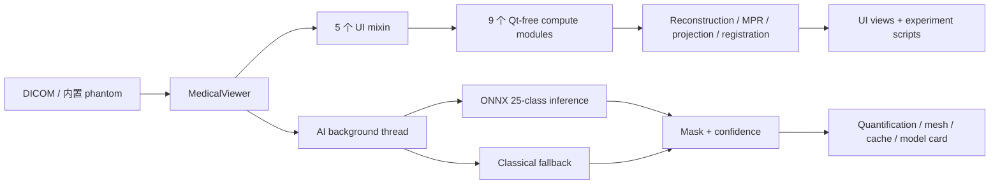

# 医学影像工作站软件项目综合报告

**项目名称：** 医学影像工作站软件（Medical Imaging Workstation + Reconstruction Lab）<br>
**报告日期：** 2026-08-25<br>
**报告用途：** 研究生申请与算法作品集审阅、项目阶段复盘、后续研究决策<br>
**软件定位：** 教学 / 科研工具，非医疗器械，不得用于临床诊断<br>
**审计基线：** Git `0a9bfca3a4452feca22f646c063bf9364068a966`，加上本次审阅后的 5 份文档真实性修正与中英文报告入口：`CHANGELOG.md`、`README.md`、`README.zh-CN.md`、`docs/preprint_recon.md`、`experiments/README.md`；这 5 份文件相对该基线的 unified diff SHA-256 为 `1f2caf8cd69f54778049b60dc33449cb32e4b9aa6f3af3945b7de33caaaea698`

> 本报告刻意区分四类信息：**本次实测**、**可由仓库产物复算**、**历史实测但未归档**、**推断或未测项**。数值不因叙事需要而跨越这些边界。

审计基线 diff 的确定性校验命令为：`git diff 0a9bfca -- CHANGELOG.md README.md README.zh-CN.md docs/preprint_recon.md experiments/README.md | shasum -a 256`。Hash 用于确认同一 patch，不替代 patch 内容本身；独立审阅仍需同时取得上述 diff。

---

## 摘要

本项目是一个基于 **Python 3.10、PySide6/Qt6、pydicom、NumPy/SciPy、scikit-image 与 ONNX Runtime** 的桌面 CT 影像工作站。它把临床式 DICOM 阅片、多平面重建（MPR）、多器官 AI 分割、器官定量、三维表面重建、随访对比和 CT 重建教学实验室整合在同一应用中，并通过 `experiments/` 对产品代码本身开展四条量化研究。

项目最有价值的部分并非“功能很多”，而是形成了一条可审计的闭环：

1. 产品中的数值逻辑被抽成无 Qt 模块，可用合成数据独立测试；
2. 重建实验直接调用产品的 `recon.py`，分割研究复现产品的真实推理契约；其中 ASD-POCS 虽已进入 `recon.py`，但当前仅由实验与测试调用、尚未接入 GUI；
3. 研究不仅保留正结果，也保留被大样本推翻的试跑结果和被后续测量撤回的结论；
4. 数据、模型、许可、软著快照和当前代码之间的边界均被显式记录。

截至本报告日期，项目已经具备较强的**作品集展示价值和工程可信度**：本机全套回归实测 **629 PASS / 0 FAIL / 0 traceback**，数据无关子集 **539 PASS / 0 FAIL / 0 traceback**，fresh local clone 子集 **520 PASS / 0 FAIL / 0 traceback**，Ruff 通过，产品代码覆盖率 **90%（3,438 statements，336 missed）**。**2026-08-25 已验证 baseline 为 `5c555ef`**：远端 [run 32831264615](https://github.com/sunce764/medical-imaging-workstation/actions/runs/32831264615) 记录 **520 PASS / 0 FAIL**、coverage 81%、Ruff PASS，`event=workflow_dispatch`；后续远端状态以 GitHub Actions run 及其精确 `headSha` 为准。项目仍然不是临床产品，也还不是一项已完成的临床研究：分割验证来自单一公开数据源，教师模型很可能见过该数据；学习式重建使用无噪声合成投影；部分历史性能数字没有归档原始日志。自动 `push` trigger 仍是已知异常，但已接受以 manual exact-SHA CI 作为非阻塞性闭环，不再将根因深挖作为 P0。

综合判断：这是一个“**产品实现 + 算法研究 + 证据治理**”结合得较完整的医学影像算法作品集。其可信度主要来自对错误结论的主动撤回、对推理路径的同口径比较，以及对不可复现部分的明确承认，而不是来自单个最高 Dice 或功能数量。

---

## 1. 项目背景与目标

### 1.1 要解决的问题

传统 DICOM viewer 能完成图像浏览，却通常把算法视为不可检查的附加按钮；纯算法 notebook 又缺少真实产品中的数据加载、几何、交互、内存、线程、缓存和错误处理。本项目尝试连接这两端：

- 在临床式工作站界面里运行真实的 DICOM、MPR、分割、定量和重建流程；
- 把关键数值逻辑从 GUI 中解耦，允许对产品代码做可复现测量；
- 用实验证据回答“算法何时有效、何时失效、代价是什么”，而不是仅展示效果图。

### 1.2 目标用户与使用场景

- 医学影像、Biomedical Engineering、AI 方向的教学演示；
- CT reconstruction、segmentation、inference contract 的科研原型与误差分析；
- 研究生申请中的工程与研究作品集；
- 软件著作权登记所对应的产品实现。

本项目不适用于临床诊断、治疗决策、真实医院部署或合规医疗数据管理。

### 1.3 当前阶段

| 事项 | 当前状态 | 证据与说明 |
|---|---|---|
| 产品代码 | 持续演进，版本标记 `1.1.0.dev0` | [`pyproject.toml`](../pyproject.toml) |
| GitHub 仓库 | **PUBLIC** | 本报告日通过 GitHub CLI 实查；[repository](https://github.com/sunce764/medical-imaging-workstation) 为 review-only proprietary license |
| 软著登记 | 据项目方提交记录，截至 2026-08-25 已提交，两位著作权人尚未收到正式受理通知；不是“登记成功” | [`LICENSE`](../LICENSE) 是项目方状态声明，不是 CPCC 官方受理证明 |
| 软著 V1.0 快照 | 仓库可验证快照形成于 2026-07-08，source builder 列出 13 个产品模块 | 据项目方记录，该快照用于登记提交；`experiments/` 未包含在提交的源码或说明书材料中 |
| 当前产品模块 | 18 个顶层 Python 模块，约 6,737 行 | 本报告日 `wc -l`；不含 tests 与 experiments |
| 量化研究 | 4 条研究主线、69 个已提交结果文件 | [`experiments/README.md`](../experiments/README.md) |
| 正式论文 / venue | 尚未确定 | `docs/preprint_recon.md` 是稿件，不等于已投稿或已发表 |

---

## 2. 产品能力

### 2.1 临床式阅片工作流

工作站支持按序列加载 DICOM、解剖顺序排序、HU 转换、轴位 / 冠状位 / 矢状位 MPR、十字线联动、窗宽窗位、反色、Cine 播放、厚层 MIP / MinIP / AIP，以及双序列随访对比。测量与标注包括卡尺、ROI、自由画笔、套索、矩形截取、分割画笔 / 橡皮和三维追踪等。

实现中的重点不是控件数量，而是物理与状态一致性：

- HU 转换通过 `RescaleSlope` / `RescaleIntercept`，对 `None`、NaN 和 Inf 做统一防护；
- DICOM 排序在序列级统一决定使用 `ImagePositionPatient[2]` 或 `InstanceNumber`，避免逐切片混合类型排序；
- 三平面显示、测距、厚层投影、体积与三维网格统一使用真实 spacing；
- 随访比较仅提供 2-D rigid registration，若 NCC 没有改善则拒绝应用变换。


### 2.2 AI 多器官分割与定量

产品内置的 ONNX 图对应 25 类输出（24 个器官 + background）。在外部权重存在时，应用进行 CPU-only 3-D 推理；权重缺失或 ONNX 失败时，明确降级为经典肺部 connected-components 算法，而不是把降级结果冒充多器官 AI 成功。

分割结果可用于：

- 三平面彩色 mask overlay 与可点击图例；
- 器官体积、mean / SD / median / min / max / p5 / p95 HU 统计；
- 逐体素 softmax maximum probability 与器官级 confidence 摘要；
- marching cubes 表面提取、Taubin smoothing、shape statistics、交互式三维预览与 STL 导出；
- 手工修正、撤销、工程保存和按序列安全恢复。


### 2.3 CT 重建教学实验室

应用可在空载状态下生成解析 Shepp-Logan phantom，并演示 sinogram、BP、FBP、DFR、DMR、ART、SIRT 和学习式 CNN 后处理。界面显示重建结果、误差图、RMSE 与耗时，并标明 CNN 的训练 views 和输入 filter 限制。ASD-POCS 已实现在同一 `recon.py` 数值模块中，但目前没有 GUI 入口，只由实验与测试调用。

这里明确区分“本项目实现”和“调用成熟库”：

| 组件 | 实现方式 | 代码位置 |
|---|---|---|
| Radon、BP、5 种 filter 的 FBP | 调用 `skimage.transform.radon / iradon` | [`recon.py`](../recon.py) |
| DFR | 基于 central slice theorem 自行实现，含偶数尺寸半像素校正 | [`recon.py`](../recon.py) |
| 解析 Shepp-Logan phantom | 十个解析 ellipse 叠加，自行实现 | [`recon.py`](../recon.py) |
| System matrix、DMR、ART、SIRT | 自行实现 | [`recon.py`](../recon.py) |
| ASD-POCS / TV | 按 Sidky & Pan 伪码自行实现并做数值对拍；当前为 experiment/test-only，未接入 GUI | [`recon.py`](../recon.py) |
| Sparse-view reconstruction CNN | 自训 1.9M residual U-Net | [`experiments/recon_dl.py`](../experiments/recon_dl.py) |


### 2.4 安全与审阅功能

- 常驻“教学 / 科研、非医疗器械”声明；
- 中英文界面与文档；
- 显示层去标识、导出文件名净化和路径穿越防护；
- 模型卡从已提交实验结果中实时读取 provenance、验证范围与未测边界；
- AI 失败、fallback、spacing resampling 和手工编辑状态对用户可见。

“显示层去标识”不等于清洗 DICOM：底层 tag 与可能存在的 burned-in annotation 不会被自动删除。

---

## 3. 系统架构

### 3.1 分层结构



`MedicalViewer` 仍是主状态容器，但已拆成 5 个 UI mixin：`ui_builder`、`interaction`、`recon_lab`、`compare_lab`、`annotation_lab`。数值逻辑集中在 9 个无 Qt 模块：`recon`、`quantify`、`segmentation`、`mpr_geometry`、`followup`、`projection`、`mesh3d`、`registration` 和 `model_card`。

这种设计允许 CI 在没有显示器、真实 DICOM 和 119 MB 权重时，仍然对几何、HU、reconstruction、registration、quantification、mesh、fallback 和文档契约做合成数据测试。

### 3.2 AI inference contract

模型输入输出契约来自 ONNX 结构和实测，而不是猜测：

- 输入 `[1, 1, D, H, W]`；空间维 padding 到 32 的倍数；
- HU clip 到 `[-1000, 400]` 后归一化到 `[0, 1]`；
- 输出 `[1, 25, D, H, W]` logits，以 `argmax(axis=1)` 取类别；
- 必须使用完整 xy frame；256 center crop 会破坏全局上下文；
- 产品当前沿 z 使用 32 层 block，无常规 overlap；末 block 回移以避免“2 层真实数据 + 30 层合成空气”；
- 25% z-overlap 的实验收益已测量，但因收益 / 成本权衡，**当前没有进入产品路径**。

### 3.3 Spacing resampling

产品推理前根据真实物理 spacing 重采样到 1.5 mm isotropic，推理后以 nearest-neighbor 把 label 和 confidence 映回原网格。以下情况不重采样：

- spacing 缺失或非法；
- 三轴均在目标值 5% 内；
- 放大后超过预设 voxel budget 且比原体积更大。

层间距优先由连续切片的 `ImagePositionPatient` 计算，其次使用 `SpacingBetweenSlices`，最后才回退到 `SliceThickness`。这一规则同时服务 MPR、volume、mesh 与推理，避免同一序列在不同功能中采用不同物理尺度。

### 3.4 Threading 与生命周期

ONNX inference 在 Python background thread 中运行，Qt UI 更新只通过 signal / queued connection 回到 main thread。项目曾实测证明 `QTimer.singleShot` 依附于没有 Qt event loop 的 worker thread，回调不会执行；`_AISignals` 若以 viewer 为 parent，也可能在 worker emit 前被销毁。当前实现采用 parentless signal carrier、generation guard、cancel 和 teardown error classification，防止旧推理覆盖新加载或已恢复的 mask。

### 3.5 Persistence 与安全恢复

annotation 与 mask 保存到本地 `Exported_Lesions/`。mask cache 不能只凭 `PatientID + shape` 恢复，而必须同时匹配 `SeriesInstanceUID`；同一患者的另一序列即使也是 512×512，也会被拒绝套用。该设计避免错误 mask 进一步生成错误器官体积或 STL。

---

## 4. 四条量化研究主线

### 4.1 证据总览

| 研究 | 核心问题 | 主要结果 | 最重要边界 |
|---|---|---|---|
| Study I | reconstruction 方法与采样 / noise 如何交互 | filter 最优选择随 views 改变；旧的 ART 排名被撤回；ASD-POCS 优势随 SNR 改变 | 2-D analytic phantom；matrix 方法约限于 64² |
| Study II | 未文档化 segmentation model 是什么、能否信 | 21 个已观察 label 与 TotalSegmentator v2 方案一一对应；20 例多器官 Dice 0.909；spacing 修复 +0.155 | 同一公开数据源；非独立外部临床验证 |
| Study III | learned reconstruction 恢复了什么、虚构了什么 | 1.9M CNN 将 RMSE 降低 3–6×；false-structure rate 1.7% | noise-free synthetic projection；该值是有利条件下的 optimistic estimate，noisy CT 方向未测 |
| Study IV | 小模型压缩为何失败、评估路径是否可信 | inference path 使同一权重 0.490→0.746；zero-padding control 指向 tensor extent / `InstanceNorm3d`；同路径 student 比 teacher 低 0.450 | teacher/student 任务、数据与训练预算均不等价 |

### 4.2 Study I：Dose–quality 与 reconstruction baseline

#### A. Views 增加与离散化地板

在 256×256 analytic Shepp-Logan phantom 上，FBP Ram-Lak 的 circle-mask RMSE 随 projection views 从 15 到 360 由 **0.22229 降至 0.03547**，SSIM 从 **0.3539 升至 0.9544**。早期文本把约 180 views 后的平台解释成“剂量足够”；后续把 views 扫到 720 / 1440 / 2880，RMSE 分别为 **0.035394 / 0.035386 / 0.035388**，证明平台主要是当前 reconstruction chain 的 discretisation floor，而不是一个可外推的 dose operating point。

因此，合法结论是“当前实现已触及其离散化地板”，不是“180 views 足够用于 CT”。

这里的横轴首先是 **sampling density**。实验 A/B 不加入 photon noise，也没有 fixed-total-photon design；把 views 称为 dose proxy，只表示“更少 acquisition angle 可对应更低扫描量”的教学近似，不能直接解释成 clinical radiation dose。实验 C/D 才引入 Beer–Lambert + Poisson noise，其中 `I0` 是**每条 ray 的 incident photon count**；各 views 档使用相同 `I0`，所以总 incident photon budget 会随 views 增加，而不是固定总 dose 下只重分配 photons。

#### B. Filter inversion

Sparse views 下 smoothing filter 更优，dense views 下 sharp Ram-Lak 更优：20 views 时 Hann RMSE **0.14295**，优于 ramp **0.17578**；60 views 时 ramp **0.05619**，优于 Hann **0.05882**；交叉位于约 45–60 views。这说明 filter 选择依赖采样条件，不存在脱离 sampling density / views 的全局最优 filter。

#### C. Analytic 与 iterative 方法

在 64×64、`I0=3×10⁴` 的 Beer–Lambert + Poisson 模型下，早期固定 `ART=5 sweeps` 与 `SIRT=100 iterations`，形成约 1:20 的 compute imbalance。对各自 stopping point 做 sweep 后，SIRT 在 30 / 60 / 90 views 的自身最优点均比 ART 低约 9–20% RMSE，原“ART 最鲁棒”结论已撤回。

Near-square least-squares 系统在 60 views 出现 RMSE **0.61078**。SVD 表明 30 与 60 views 的系统均 rank-deficient，2-norm condition number 为 infinite；在 least-squares 实际保留的 spectrum 上，noise gain 为 **29.45 / 1075.55 / 46.88**（30 / 60 / 90 views）。该结果支持“near-square regime 存在强 noise amplification”的定性判断，但不能把该 operator 指标与 end-to-end RMSE 相除后宣称一个定量归因比例。

#### D. ASD-POCS / TV baseline

新增 ASD-POCS 后，在 `η≈0.9%` 的 Shepp-Logan 条件下，相对 SIRT 各自最优点的 RMSE gain 为：

其中 `η = ‖p_noisy − p_clean‖₂ / ‖p_clean‖₂`，是 sinogram 的相对 L2 noise level，不是 scanner dose 的直接单位。

| Views | SIRT best | ASD-POCS best | Gain vs SIRT |
|---:|---:|---:|---:|
| 30 | 0.039983 | 0.018129 | +54.66% |
| 60 | 0.023122 | 0.011829 | +48.84% |
| 90 | 0.016736 | 0.009182 | +45.14% |

当 noise 增至 `η≈9%`，优势在 60 / 90 views 变为 **−0.79% / −10.03%**，30 views 仍为 **+6.40%**。因此可报告的不是“TV 永远更好”，而是其收益具有明确的 SNR 与 sampling dependence。TV-adversarial phantom 没有推翻低噪声下优势，但 30-view 的最优点仍落在 sweep grid edge，说明超参数搜索并未完全闭合。

### 4.3 Study II：Segmentation provenance、multi-case validation 与 spacing contract

#### A. Provenance recovery

`models/organs.onnx` 没有 `dataset.json` 或原始 checkpoint 信息。项目在带真值的公开 CT 上计算 prediction label 与 ground-truth organ 的 overlap confusion matrix，**21 个在场器官 label**形成 identity diagonal，并纠正 label 5 与左右 lung lobe 的历史错误。该例没有 prostate 与左右 kidney cyst 真值，因此 labels 22–24 没有被这个 confusion matrix 直接验证；它们的名称来自“已观察到的 1–21 顺序匹配同一 class map”这一方案级 inference。

需要保持三层口径：labels 1–21 的 mapping 是 measurement；labels 22–24 是 scheme-level inference；权重恰好来自某个 exact upstream release 则是由 architecture、mapping 与 exporter 信息构成的更进一步 inference，不是 cryptographic proof。

#### B. 20-case multi-organ validation

20 例 patient-level mean Dice 为 **0.9090，95% CI [0.8889, 0.9266]**：先对每例所有在场器官取 mean，再对 20 个 case mean 做 seeded bootstrap。器官间差异显著：liver **0.9816**、spleen **0.9760**，right upper lung lobe **0.7733**。左右 kidney cyst 各只在 1 例出现，不能给出有意义的跨例 CI；其他 per-organ 行按“该器官在 GT 中在场的 cases”聚合。总体均值不能替代逐器官可靠性。

#### C. 57-case lung-lobe validation

57 例、234 个 lobe instance 的 mean Dice 为 **0.8867**。instance-level bootstrap CI 为 **[0.8587, 0.9139]**，case-clustered bootstrap CI 为 **[0.8550, 0.9139]**。right upper lobe 最弱，mean Dice **0.7273**；right lower lobe 最高，**0.9565**。Study IV 的 teacher row 复用的就是这同一 cohort、同一结果，不是第二次独立验证。

#### D. Spacing contract ablation

产品曾跳过 nnU-Net 推理前的 spacing resampling。单例 controlled ablation 中，输入 spacing 从 1.5 mm 变为 3.0 mm 时，21-organ mean Dice 从 **0.9219 降至 0.7995**，且小器官先失效并可能非单调。

修复后进行 20-case paired validation：同一失配输入直接送入模型为 **0.6845**，经产品 engine resampling 为 **0.8399**，mean paired gain **+0.1554，95% CI [+0.1103, +0.2110]**，Wilcoxon `p=1.91×10⁻⁶`，20/20 cases 改善。

本地 RIDER 单序列的历史性能记录为 **100 s / 8.8 GB → 37 s / 3.0 GB**。这组数字是单机实测但没有结果文件支撑，不能视为跨机器 benchmark。

### 4.4 Study III：Learned sparse-view reconstruction

项目从零训练一个约 **1.9M parameter residual U-Net**，输入 ramp-FBP，输出 residual correction。每个 view 档使用 600 train / 80 validation / 80 held-out synthetic test phantoms；train、validation、test 和 lesion-pairing 四个用途来自互不重叠的 seed band，OOD probe 另由固定 seed 生成；训练 40 epochs，checkpoint 只按 validation 选择。15–60 views 下：

- CNN RMSE 为 **0.01097 → 0.00349**；对应最佳 linear filter 为 **0.0415 → 0.01962**，改善约 3–6×；
- lesion contrast retention 从 ramp 的约 **0.87** 提升到 **0.957–0.996**；
- 60 组 paired phantom 上，20%-of-true-lesion threshold 的 false-structure rate 为 **1.67%**，30% 与 50% threshold 为 0%；
- 每类 24 个 unseen phantom 中，square / polygon 的 RMSE gain 为 **81.61% / 87.22%**，high-frequency line gratings 仅 **24.06%**；overall OOD gain ratio **0.807** 定义为三类 OOD RMSE gain 的均值除以 20-view in-distribution RMSE gain。

这些结果支持模型更接近“de-streaking operator”而非只记忆 ellipse，但只能覆盖所测的三类 synthetic OOD shape。所有 projection 都是 **noise-free**；因此 1.67% 只能写成有利条件下的 optimistic estimate，noisy CT 中风险的方向和幅度均未实测，不能把它当作数学意义上的 lower bound。旧权重产出时 PyTorch RNG 尚未固定，当前代码中的 `torch.manual_seed` 只保证未来运行，不追溯保证历史 artifact byte-reproducibility。

### 4.5 Study IV：3-D student compression 与 evaluation-path defect

#### A. 研究设计

数据 manifest 固定在 TotalSegmentator-CT-Lite commit `6f14b84...`，共 297 cases，patient-level split 为 **207 train / 29 val / 61 test**。student 是从零训练的 3-D U-Net，当前主要模型为 **351,206 parameters**；teacher 是随产品发布的约 **31.2M parameter** 25-class nnU-Net。

早期同一 student architecture 仅训练 1,200 steps，`zslab` five-lobe Dice 为 **0.0620**，并一度被解释为 receptive-field / capacity ceiling。把唯一主要变量改为 33,600 steps 后，同一路径升至 **0.4903**，五类均开始被预测；这使旧的因果解释失效，但仍不能回答 depth、capacity 或完整 training budget 各自贡献多少。

Validation denominator 为 29 → 24：`s0009`、`s0104`、`s0361`、`s0316`、`s0129` 的 GT 没有任何 lung lobe，评估脚本在 inference 前跳过；其余 24 例对 GT 中实际在场的 lobes 取每例 mean。下文的 0.4903 / 0.7457 均使用这同一批 24 例。

#### B. 评估缺陷

同一 student weights 在 validation set 上：

- full-plane `zslab`：five-lobe Dice **0.4903**；
- training-patch-sized `sliding`：**0.7457**。

Zero-padding control 保持所有真实 input voxel 不变，只扩大 tensor，predicted foreground 从 **225,374 降至 1,529 voxels**，减少 99.3%。机制证据指向 `InstanceNorm3d`：HU normalization 后 air 与 padding 都为 0，spatial extent 改变 normalization statistics，从而压制 foreground。五条 targeted control 使 overlap blending、content change 和单纯 generalisation failure 等竞争解释与观测不一致；它们不是统计独立的五次试验，也没有通过替换 normalization layer 完成直接 intervention，因此报告保留“机制证据指向”而不写成唯一因果证明。

#### C. Product-path measurement

Teacher 的 shipped path 是 full-xy、z-block=32、per-block argmax。一个 3-case validation 2×2 grid 曾显示 z-overlap 最高约 **+0.205**；实验性 25% z-overlap + logit accumulation 扩到 test split 后，在 59 个可评 cases 上将 all-organ per-case mean Dice 从 **0.8973 提升到 0.9105**，paired gain **+0.0133，95% CI [+0.0072, +0.0194]**，54/59 cases 改善；five-lobe CI 跨 0。Pilot 与 full-test endpoint 都是比较 no-overlap 和 overlap 的 teacher inference；被大幅收缩的是 pilot 所暗示的**大效应量**，不是 full test 中小幅正 gain 的方向。Pilot 只有 3 例，不能作为效应量。

相对代价为 **1.18× wall-clock**，该比例可由 committed per-case CSV 复算。历史 peak memory **8.44 → 9.09 GB** 只存在于终端记录，没有归档 artifact。因此产品当前保留 no-overlap path；不能把实验配置写成 shipped feature。

#### D. Teacher–student 同路径比较

在 57 个含 lung lobe 的 test cases、234 个 lobe instances 上：

Denominator flow 为：297 total → 207/29/61 split → test 中 `s0099`、`s0340` 没有任何 24-class in-scope organ，故 all-organ paired analysis 为 59 cases → 其中 `s0062`、`s0188` 没有 lung-lobe GT，故 lobe analysis 为 57 cases。每例只对 GT 中实际在场的 lobe 计一行，双方都为空时 Dice 未定义且不作为 true negative 计入；limited field of view 使 57×5 不等于 234，实际为 234 present-lobe instances。

| Model | Inference path | Five-lobe Dice | Instance bootstrap CI | Case-clustered CI |
|---|---|---:|---:|---:|
| Teacher 31.2M | `zslab` | 0.8867 | [0.8587, 0.9139] | [0.8550, 0.9139] |
| Student 0.35M | `zslab` | 0.4367 | [0.3972, 0.4756] | [0.3732, 0.4992] |
| Student 0.35M | `sliding` | 0.7667 | [0.7255, 0.8072] | [0.7155, 0.8122] |

Teacher 与 student 在同一 `zslab` path 上的 paired difference 为 **−0.4500 [−0.4877, −0.4118]**。Student `sliding=0.7667` 不能与 teacher `zslab=0.8867` 直接比较，因为仅 inference path 就能让相同 student weights 相差约 0.33 Dice；test split 上没有 matched teacher-sliding result。

研究仍存在重要 confounding：teacher 很可能在原始 TotalSegmentator training data 中见过这些 cases，而 student 使用真正 hold-out；teacher 是 25-class、student 是 5-class；training data、task breadth、capacity 与 augmentation 同时变化；student 仅训练 33,600 steps，约为参考 250,000 steps 的 13.4%，曲线尚未收敛。因此不能把 0.45 gap 单独归因于 parameter count。

### 4.6 Headline evidence matrix

证据类型：**A** = 本报告日重新运行；**B** = 可由 committed machine-readable artifact 读取或复算；**C** = 历史单机实测但无归档 artifact；**D** = inference / unmeasured。B 类并不自动等于 end-to-end reproducible：需要外部 data / weight 的行会另行标出。

| Headline claim | Aggregation / denominator | 类型 | 精确证据与生成入口 |
|---|---|:---:|---|
| FBP 15→360 views，RMSE 0.22229→0.03547 | 每个 view 档 1 个 256² analytic phantom，circle-mask pixel RMSE | B | [`exp_a_dose_quality.csv`](../experiments/results/exp_a_dose_quality.csv) · [`recon_study.py`](../experiments/recon_study.py) · `python experiments/recon_study.py a` |
| 720/1440/2880 views 的 floor ≈0.03539 | 同一 phantom / metric，6 个 view 档 | B | [`exp_a_metric_floor.csv`](../experiments/results/exp_a_metric_floor.csv) · [`recon_floor.py`](../experiments/recon_floor.py) |
| Filter crossover 45–60 views | 1 个 phantom × 6 views × 5 filters | B | [`exp_b_filters.csv`](../experiments/results/exp_b_filters.csv) · [`recon_study.py`](../experiments/recon_study.py) · `python experiments/recon_study.py b` |
| SIRT own optimum 比 ART 低 9–20% | 30/60/90 views；各自在预设 iteration grid 上 oracle-select minimum RMSE | B | [`exp_c_stopping.csv`](../experiments/results/exp_c_stopping.csv) · [`recon_stopping.py`](../experiments/recon_stopping.py) |
| ASD-POCS 的 SNR-dependent gain | 2 phantoms × 3 `I0` × 3 views；各 solver 在各自 iteration grid 取 minimum | B | [`exp_c_asdpocs.csv`](../experiments/results/exp_c_asdpocs.csv) · [`recon_tv.py`](../experiments/recon_tv.py) |
| Labels 1–21 observed mapping；22–24 scheme mapping | 1 case；21 GT-present labels 逐 label overlap；3 个 GT-absent labels 不构成 direct measurement | B（1–21）/ D（22–24） | [`seg_dice.csv`](../experiments/results/seg_dice.csv)、[`seg_mapping.md`](../experiments/results/seg_mapping.md) · [`seg_validate.py`](../experiments/seg_validate.py) |
| 20-case multi-organ Dice 0.9090 | 每 case 先对在场 organs 取 mean；再对 20 个 case mean bootstrap | B，需外部 data / weight | [`seg_multi.csv`](../experiments/results/seg_multi.csv)、[`seg_multi_per_organ.csv`](../experiments/results/seg_multi_per_organ.csv) · [`seg_multi.py`](../experiments/seg_multi.py) |
| Spacing fix +0.1554 | 20-case paired；每 case 为在场 organs mean；paired bootstrap + Wilcoxon | B，需外部 data / weight | [`seg_spacing_fix_multi.csv`](../experiments/results/seg_spacing_fix_multi.csv) · [`seg_spacing.py`](../experiments/seg_spacing.py) |
| Teacher lobe Dice 0.8867 | 57 cases / 234 GT-present lobe rows；同时给 instance 与 case-clustered bootstrap | B，需外部 data / weight | [`seg3d_teacher_dice.csv`](../experiments/results/seg3d_teacher_dice.csv)、[`seg3d_teacher_summary.json`](../experiments/results/seg3d_teacher_summary.json)、[`cluster_ci.json`](../experiments/results/cluster_ci.json) · [`seg3d_teacher.py`](../experiments/seg3d_teacher.py)、[`cluster_ci.py`](../experiments/cluster_ci.py) |
| CNN RMSE、lesion retention | 每 view 档 80 held-out phantoms；global pixel RMSE / per-phantom SSIM / generated-lesion contrast mean | B，historical weights 非 byte-reproducible | [`recon_dl_matrix.csv`](../experiments/results/recon_dl_matrix.csv) · [`recon_dl.py`](../experiments/recon_dl.py) |
| False-structure 1.67%；OOD ratio 0.807 | 60 paired phantoms；3 OOD families × 24，ratio 定义见 §4.4 | B，historical weights 非 byte-reproducible | [`recon_dl_hallucination.csv`](../experiments/results/recon_dl_hallucination.csv)、[`recon_dl_ood.csv`](../experiments/results/recon_dl_ood.csv) · [`recon_dl.py`](../experiments/recon_dl.py) · `python experiments/recon_dl.py halluc ood` |
| Student path 0.4903→0.7457 | 同一 weights、24 validation cases；两条 inference path | B，需外部 data / weight | [`seg3d_diag_ch8d3_33600s_zslab.json`](../experiments/results/seg3d_diag_ch8d3_33600s_zslab.json)、[`seg3d_diag_ch8d3_33600s_sliding.json`](../experiments/results/seg3d_diag_ch8d3_33600s_sliding.json) · [`seg3d_diag.py`](../experiments/seg3d_diag.py) |
| Product overlap +0.0133 / 1.18× | 59 paired all-organ case means；time 由同一批 per-case `sec` 重算 | B，需外部 data / weight | [`seg3d_infer_bias_bench_A.csv`](../experiments/results/seg3d_infer_bias_bench_A.csv)、[`seg3d_infer_bias_bench_B.csv`](../experiments/results/seg3d_infer_bias_bench_B.csv) · [`seg3d_infer_bias.py`](../experiments/seg3d_infer_bias.py) `bench` |
| Teacher–student `zslab` −0.4500 | 234 matched `(case, lobe)` rows；正文 CI 是 instance bootstrap | B，需外部 data / weight | [`seg3d_teacher_dice.csv`](../experiments/results/seg3d_teacher_dice.csv)、[`seg3d_student_ch8d3_33600s_zslab.csv`](../experiments/results/seg3d_student_ch8d3_33600s_zslab.csv) · [`seg3d_report.py`](../experiments/seg3d_report.py) |
| 629 / 539 / clean 520、Ruff、coverage 90% | 本报告日当前 worktree；commands 见 §11 | A | Terminal exit code、PASS/FAIL/traceback count、fresh-clone run、`coverage report`；未写入 research results |
| 100s/8.8GB→37s/3.0GB；8.44→9.09GB | 各为历史单机 run | C | 文档中的 terminal record；没有可独立复核 artifact |
| Exact upstream checkpoint、noisy-CT hallucination、cross-scanner generalisation | 未形成直接 measurement | D | 明确保持 unresolved，不由 checksum 或现有 Dice 推断 |

---

## 5. 工程质量与验证

### 5.1 本报告日实测

| 检查 | 结果 | 解释 |
|---|---:|---|
| Full regression with local RIDER | **629 PASS / 0 FAIL / 0 traceback** | 真实 DICOM 在场；启动后取消 background AI，不重跑整卷分割 |
| `SKIP_REAL_DATA=1` local subset | **539 PASS / 0 FAIL / 0 traceback** | 合成 DICOM、synthetic event、pure compute 与本地模型 artifact guard |
| Fresh local clone subset | **520 PASS / 0 FAIL / 0 traceback** | 不含未分发 weights / checkpoints；验证 README clean-run 计数 |
| Ruff | **PASS** | `ruff check .` |
| Full-suite coverage | **90%** | 3,438 statements，336 missed |
| Dated verified baseline | **2026-08-25 baseline `5c555ef`** | 这是日期化证据基线，不声称它永久等于后续 HEAD；新远端状态必须另绑定 run / `headSha` |
| Remote CI | [run 32831264615](https://github.com/sunce764/medical-imaging-workstation/actions/runs/32831264615) 覆盖已验证 baseline `5c555ef`，lint / test 均通过 | clean subset **520 PASS / 0 FAIL**，coverage 81%，Ruff PASS；`event=workflow_dispatch` |

审计基线的 coverage run 曾发出一条 `signature_bootstrap.py` 无源 warning。后续诊断确认它是 PySide6 / shiboken 注入的虚拟模块：`__file__` 只有相对名，coverage 因而误解析为仓库根文件。配置现已精确 omit 该虚拟 basename，并移除 `ignore_errors=true`；修复前后实际产品 totals 不变，复跑为 **0 ghost warning**，未来未知无源条目也不会被静默吞掉。同次复跑发现一处 synthetic fixture 使 Qt slot 抛 `IndexError`却仍 exit 0；fixture 已修正，runner 已把未捕获 Qt slot exception 统一转为 FAIL，并用已知坏 probe 自检。

### 5.2 覆盖面

测试不是只检查“程序没崩”，而包括：

- DICOM mixed shape、multi-frame、corrupt pixels、empty / NaN / Inf tags；
- HU known values、series-level sorting、anisotropic spacing；
- export path traversal、mask cache UID guard、stale AI callback；
- MPR coordinate mapping、mouse / wheel / Cine、annotation 与 undo；
- Radon linearity、mass conservation、FBP / DFR correctness、system-matrix parity；
- ART / SIRT convergence、ASD-POCS finite-difference TV gradient；
- quantification、rigid registration、slab projection、mesh volume / area / STL；
- model card artifact reading、checksum binding、withdrawn-claim regression；
- Chinese / English persistent UI coverage。

### 5.3 已修复的高风险缺陷类型

项目变更记录保留了多轮 defect audit，代表性问题包括：

- same-patient different-series mask 被错误复用；
- `PatientID="../..."` 导致导出路径穿越；
- `SliceThickness` 被误作 slice spacing；
- 3-D tracking 清除所有 AI organ label；
- background AI teardown 与 stale callback race；
- DFR orientation / half-pixel alignment；
- model card 遇到损坏 CSV 崩溃；
- evaluation path 因 tensor size 与 `InstanceNorm3d` 抑制 foreground；
- 不公平 stopping schedule 生成错误 solver 排名；
- 语义撤回只匹配 exact phrase，导致错误结论在其他文档回潮。

这些问题共同说明：医学影像软件的主要风险往往不在模型能否运行，而在 geometry、metadata、state、evaluation denominator 和 artifact provenance。

### 5.4 工程上的剩余不足

- `tests/test_gui.py` 是自定义 PASS/FAIL runner，而非 pytest test collection；易读但生态集成较弱；
- GitHub Actions 的 push trigger 已多次不触发，当前依赖 manual dispatch，根因未明；
- 仓库不是可直接安装的完整 package，资源按 source-tree relative path 定位；
- 完整测试依赖本地 RIDER data，clean CI 只能执行 data-independent subset；
- ONNX external weights 和部分 PyTorch checkpoints 不由普通 clone 获取；
- 少量 historical performance 数字只有终端记录，没有 machine-readable artifact。现有两个 benchmark 入口已建立 timestamped JSON provenance 合约（machine、config、wall time、process peak、Git / dependency / 完整 ONNX graph + external-data hashes），但尚未重跑，不能把代码能力冒充历史产物。

---

## 6. 数据、模型与 reproducibility

### 6.1 数据边界

| 数据 | 用途 | 是否入库 | 边界 |
|---|---|---:|---|
| RIDER Lung CT | 本地产品与完整 regression | 否 | TCIA 公开、去标识；仍不转载 |
| TotalSegmentator-CT-Lite | screenshots、multi-organ / lung-lobe validation、student training | 否 | CC-BY-4.0；manifest 固定 commit 与每文件 hash |
| Analytic / random synthetic phantom | reconstruction studies | 由代码生成 | 可固定 seed；不含 patient data |

“公开去标识人体 CT”不能被写成“非患者数据”。据项目方提交记录，软著 PDF 是用于登记申请的冻结快照，其中相关措辞有已知勘误；Markdown manual 已更正。在项目方尚未收到正式受理通知期间，不应重建或修改该 PDF。

### 6.2 模型 artifact

- Git tracked：两个 ONNX computation graph；
- Git 不分发：`organs.onnx.data`（约 119 MB）、`recon_dl_v20.onnx.data`（约 7.4 MB）；
- `models/CHECKSUMS.sha256` 覆盖 2 对 ONNX graph/data 与 6 个 Study III / IV checkpoint，共 10 项；
- checksum 证明当前 bytes 一致，不证明历史结果一定由这些 bytes 生成；
- `organs.onnx` 的 exact upstream checkpoint、export script 与 export arguments 从未被记录；
- Study III 的 historical training run 没有固定 PyTorch RNG，不能期望重训得到相同 bytes。

### 6.3 Reproducibility 分级

| 等级 | 内容 | 判断 |
|---|---|---|
| 强 | Study I synthetic scripts、seed、CSV、figure regeneration；pure compute tests | 可在相同依赖下复算 |
| 中 | Study II / IV 脚本、dataset commit、manifest 与 checksums | 需外部公开 data 与 model weights，成本较高 |
| 有限 | Study III historical model bytes | 当前代码可重训，但不保证复制旧 weights / results |
| 不可独立复核 | 37s / 3.0GB、8.44 / 9.09GB 等未归档 machine metrics | 只能标为历史单机实测 |

---

## 7. 合规、许可与软著

### 7.1 非医疗器械边界

本软件没有监管认证、clinical validation dossier、access control、audit trail、PACS integration safety case 或 deployment SOP。AI segmentation、organ volume、HU statistics 和 follow-up difference 仅供教学科研参考。

### 7.2 隐私边界

仓库不提交 DICOM / NIfTI patient data、`肺癌/`、`Exported_Lesions/` 或 identifiable PHI。应用的 de-identification 仅作用于 display 与 export filename，不会清洗 source DICOM。任何对外数据导出都必须另做 DICOM tag 与 burned-in text 审核。

### 7.3 License

项目本身采用 all-rights-reserved、personal / educational / portfolio review-only 的 proprietary terms。除 GitHub 服务条款为查看和站内 fork PUBLIC 仓库所允许的有限权利，以及第三方组件各自许可证授予的权利外，项目方自有代码未另行授予复制、修改、分发或其他使用许可。TotalSegmentator / nnU-Net 的使用和 attribution、Apache-2.0 text、PySide6 LGPL 边界集中记录在 [`THIRD_PARTY_NOTICES.md`](../THIRD_PARTY_NOTICES.md)。

当前仓库发布的是 Python source，不包含 Qt binaries 或 bundled executable。若未来制作 PyInstaller / py2app binary bundle，需要重新审查 LGPL distribution obligations 和当前 proprietary terms 的兼容方式。

### 7.4 软件著作权

盛超（Sheng Chao）与赖胜圣（Lai Shengsheng）共同享有本软件著作权，双方已同意公开该权属信息。据项目方提交记录，截至 **2026-08-25**，列明双方的登记申请已提交，但两位著作权人尚未收到正式受理通知，登记亦未完成；本报告未取得可公开核验的 CPCC 正式受理记录。项目方记录标记为提交版本的 V1.0 source / manual PDF 是冻结 snapshot；当前代码继续演进属于正常版本发展，但不能宣称当前 HEAD 就是提交版本。本段报告项目方状态，不替代官方证明或法律意见。

---

## 8. 项目价值评估

### 8.1 作为研究生申请作品集的优势

1. **跨层能力完整。** 同时覆盖 DICOM、Qt UI、numerical reconstruction、3-D segmentation、ONNX deployment、statistics、testing 和 documentation。
2. **产品与研究相互约束。** 研究不是另写一套 toy code；reconstruction 直接调用 product module，segmentation 按 product contract 复现。
3. **有反证而非只展示正结果。** 3-case `+0.205` 所暗示的大效应被 59-case `+0.0133` 大幅收缩，ART 排名被 fair stopping sweep 撤回，receptive-field 解释被 longer training 与 inference control 推翻。
4. **理解医学影像中的隐性契约。** Spacing、orientation、HU、SeriesInstanceUID、clustered denominator 和 model provenance 都得到实际处理。
5. **CPU-only constraint 下完成可用部署。** 通过 resampling、session cache、z-blocking 和 fallback，在没有 GPU 的条件下保持功能可运行。

### 8.2 不能夸大的部分

- 不是 clinical-grade workstation；
- 不是新的 state-of-the-art reconstruction 或 segmentation method；
- 0.909 / 0.887 Dice 不等于跨中心泛化；
- teacher–student gap 不能单独归因为 compression；
- 1.7% hallucination rate 不适用于 noisy low-dose CT；
- 软著不是已获登记；
- preprint draft 不是 peer-reviewed publication。

### 8.3 综合成熟度判断

| 维度 | 判断 |
|---|---|
| 作品集展示 | **强**：功能、代码、结果、失败案例与审计链完整 |
| 教学科研工具 | **可用**：关键流程可运行，边界写明 |
| 工程可信度 | **较强，本轮具备冻结条件**：2026-08-25 已验证 baseline `5c555ef` 有手动 CI；最终文档 commit 以 manual exact-SHA CI 为交付门。自动 `push` trigger 异常已作为非阻塞性运维约束接受；本项目按 source tree 交付，binary packaging 不是当前待收口事项 |
| 学术发表准备 | **探索阶段**：已有可写结果，但 venue、研究问题与外部验证尚未锁定 |
| 临床转化 | **不具备**：缺监管、独立临床验证、数据治理与部署体系 |

---

## 9. 风险与局限清单

| 优先级 | 风险 / 局限 | 当前处理 | 剩余动作 |
|---|---|---|---|
| 高 | 分割证据来自单一 dataset，teacher 可能见过 test cases | 明确披露，不宣称外部泛化 | 如进入论文阶段，需独立 dataset；属新实验，须另行批准 |
| 低 | GitHub Actions `push` trigger 未自动产生 run | 2026-08-25 已验证 baseline 由 manual `workflow_dispatch` 覆盖；项目收口以 manual exact-SHA CI 作为固定门 | 冻结后不继续深挖根因；仅在出现 material defect 或新的明确授权时重开 |
| 中 | Product no-overlap path 存在小幅 seam loss | 已量化收益和成本，未冒充已修复 | 仅在明确接受 +memory / +time 后决定是否采用 |
| 中 | Study III 为 noise-free synthetic | limitation 已显式写入 | 若投稿，需 realistic noise 与 external baseline |
| 中 | Historical model provenance 不完整 | 当前 hashes 与未记录项均披露 | 新模型建立 export manifest 与 result-time hash |
| 低 | Test runner 非 pytest | 自定义 runner 现已捕获 Qt slot 异常；coverage ghost-source 已按根因精确排除，且不再全局 `ignore_errors` | 可渐进迁移，不应大规模重构 |
| 低 | Frozen PDF 有“非患者数据”措辞错误 | Markdown 勘误公开 | 在项目方尚未收到正式受理通知期间不改 PDF；后续版本修正 |

---

## 10. 建议的下一阶段

### 工程冻结与外部等待

1. 工程收尾只使用一个最终门：公开文档 commit push 后，对该 exact SHA 手动触发 CI；最终 SHA 和 run URL 记在交付断点，不再回写报告制造自引用循环。
2. 自动 `push` trigger 根因不再是 P0，不阻塞项目冻结，也不在冻结后主动深挖。
3. 只有获得新的明确授权才可重开 performance run；届时必须使用已接入的 JSON provenance 合约，并核对 machine、configuration、wall time、process peak 与完整 model hashes。
4. 继续冻结项目方提交记录所指向的 `docs/*.pdf` 与签章材料；等待 CPCC 期间不重建 V1.0 snapshot，状态变化只更新非冻结 Markdown。

### P1：面向作品集的表达

1. 以本报告为中文长版，README 作为 3-minute overview，technical / experiments 文档作为 evidence appendix；
2. 展示三条最能代表能力的故事：spacing contract 改进产品、evaluation path defect、被大样本推翻的 pilot；
3. 任何申请材料都使用“implemented / measured / inferred / unmeasured”的分层措辞；
4. 不把研究数量、GUI 功能数或单个 best metric 当作主要卖点。

### P2：只有在锁定研究问题和 venue 后再扩实验

可能方向包括 independent segmentation dataset、matched-path teacher / student evaluation、realistic noisy learned reconstruction，以及 NSD / HD95 等 boundary metrics。但这些都属于**新增实验设计**，会消耗 data、compute 与 test-set independence；在没有明确目标、venue 与用户批准前，不应因“报告更好看”而启动。

---

## 11. 运行与复核

```bash
conda activate dicom_gui

# 空载启动，内置 phantom 可直接使用
python main.py

# 加载本地 DICOM
python main.py --data /path/to/dicom_dir

# 本地完整回归（需要本地 RIDER）
QT_QPA_PLATFORM=offscreen python tests/test_gui.py

# 数据无关子集
QT_QPA_PLATFORM=offscreen SKIP_REAL_DATA=1 python tests/test_gui.py

# Lint 与 coverage
ruff check .
QT_QPA_PLATFORM=offscreen coverage run tests/test_gui.py
coverage report
```

应用运行依赖以 [`requirements.txt`](../requirements.txt) / [`environment.yml`](../environment.yml) 为准；实验额外依赖以 [`experiments/requirements-experiments.txt`](../experiments/requirements-experiments.txt) 为准。不要用系统 Python 3.13 替代项目的 Python 3.10 环境，也不要随意升级锁定依赖。

---

## 12. 证据索引

| 主题 | 首选证据 |
|---|---|
| 产品总览与当前口径 | [`README.zh-CN.md`](../README.zh-CN.md) |
| 架构与 model contract | [`docs/ARCHITECTURE.md`](ARCHITECTURE.md) |
| Spacing defect 与修复 | [`docs/spacing_contract.md`](spacing_contract.md) |
| Study I–III technical report | [`docs/technical_report.md`](technical_report.md) |
| Study I preprint draft | [`docs/preprint_recon.md`](preprint_recon.md) |
| Study I–IV methods / limitations | [`experiments/README.md`](../experiments/README.md) |
| Machine-readable results | [`experiments/results/`](../experiments/results/) |
| Test suite | [`tests/test_gui.py`](../tests/test_gui.py) |
| Defect history | [`CHANGELOG.md`](../CHANGELOG.md) |
| Third-party licenses / datasets | [`THIRD_PARTY_NOTICES.md`](../THIRD_PARTY_NOTICES.md) |
| Model digests | [`models/CHECKSUMS.sha256`](../models/CHECKSUMS.sha256) |
| Copyright / filing status | [`LICENSE`](../LICENSE) |

---

## 结论

本项目已经超过“课程 GUI”或“模型 demo”的阶段：它把真实 DICOM product path、first-principles reconstruction、third-party model provenance、multi-case validation、failure analysis、resource constraints 和 regression testing 连接成一个可审查整体。最值得保留的核心资产不是某个最高数字，而是一套已被实践证明有效的方法：**先复现，做同路径对照，检查 denominator 与 artifact，再修改产品，最后把未测边界写出来。**

以当前状态，它适合作为研究生申请中的重点技术作品和教学科研软件展示；若要进一步发展为论文，应先选择一个足够窄且可被独立数据验证的研究问题；若要发展为临床产品，则需要完全不同层级的监管、数据、验证和质量体系。
