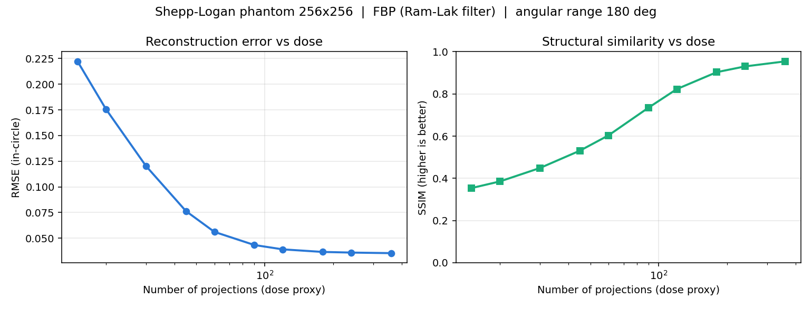
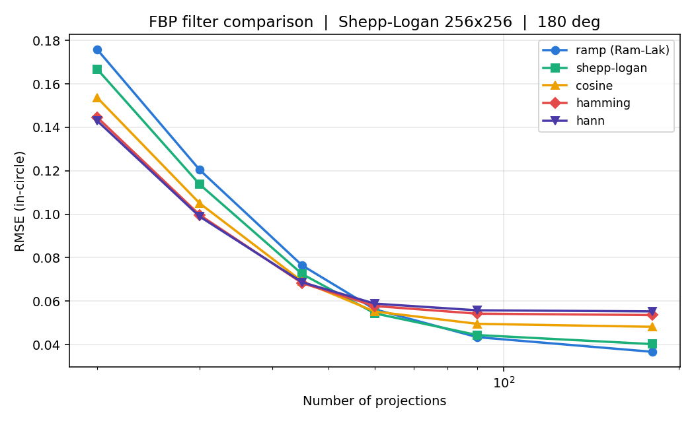
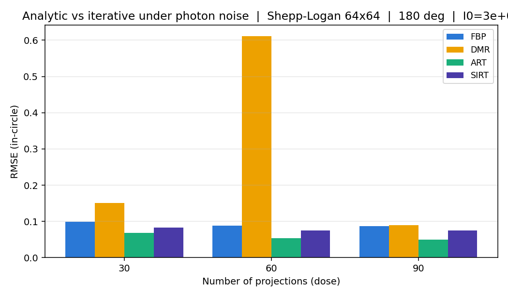
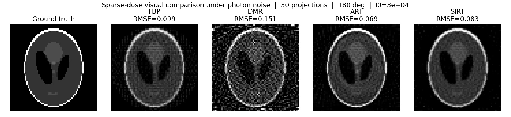
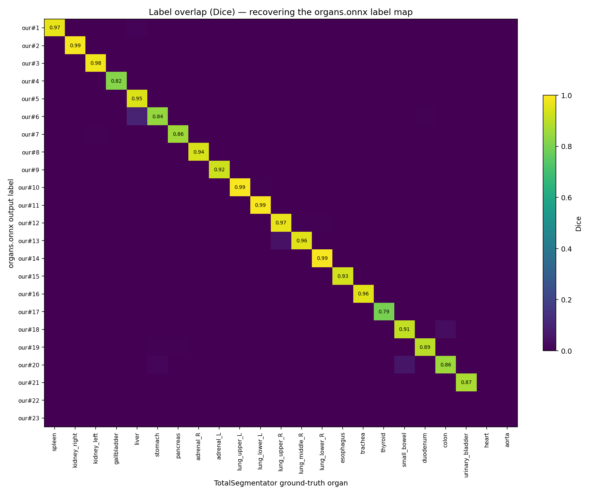

# A Teaching CT Imaging Workstation with Quantitative Reconstruction and Segmentation Studies

**Technical Report**

---

## Abstract

We present a desktop CT imaging workstation built on PySide6/Qt6 that integrates clinical reading tools, an educational tomographic-reconstruction laboratory, and an AI multi-organ segmentation pipeline. Beyond the software engineering, we contribute three quantitative studies that turn the platform's built-in algorithms into measured findings. **Study I** characterises the dose–quality tradeoff of analytic and iterative reconstruction on the Shepp-Logan phantom: reconstruction error falls monotonically with projection count and saturates beyond ≈180 views — a plateau later measured to be the reconstruction chain's own discretisation floor rather than evidence that the dose suffices, a reading withdrawn in the preprint's §4.6; the optimal apodisation filter *inverts* with dose (smoothing filters win at sparse angles, the sharp Ram-Lak wins at dense angles, crossover ≈45–60 views); and under a simplified monoenergetic Beer–Lambert + Poisson photon-noise model a constrained iterative solver (ART) reaches the lowest error at the fixed iteration counts we tested — a ranking withdrawn in the preprint's §4.5, since those counts give ART 5 sweeps against SIRT's 100 (a 1:20 compute gap) and SIRT wins at every dose by 9–20% once each solver is swept to its own optimum — while naive least-squares inversion becomes unstable near the square-system regime — a spike whose usual condition-number explanation is measured, and only partly borne out, in the preprint's §4.4. **Study II** recovers the provenance of an undocumented ONNX segmentation model by measurement rather than metadata: running the model on a single ground-truth-labelled public CT and computing a label-overlap confusion matrix yields an identity diagonal, measuring the label scheme to be TotalSegmentator v2 `class_map_part_organs` (24 organs + background, nnU-Net v2), with a mean Dice ≈ 0.92 over the 21 organs present. The mapping is measured and is the only part the code depends on; that these weights are that exact upstream release is a strong inference from it, not a cryptographic identification (§4.2). The same experiment validated the inference pipeline and corrected two long-standing label errors. A follow-on ablation then exposed a defect that this very setup had been hiding: the 0.92 was measured at the model's own training spacing, while the engine skipped nnU-Net's mandatory resampling step, so accuracy on any differently-spaced series was unmeasured rather than merely lower. Quantifying the gap (mean Dice 0.9219 → 0.7995 at twice the training spacing, with small organs collapsing first and non-monotonically) motivated implementing the step, after which mean Dice across 20 paired cases recovers 0.684 → 0.840 (+0.155, improving in every one of the 20) while inference on the local RIDER series (not distributed with the repository) drops from 100 s / 8.8 GB to 37 s / 3.0 GB. **Study III** asks what a learned reconstruction recovers and what it invents: a self-implemented 1.9 M-parameter residual U-Net used as an FBP post-processor cuts sparse-view RMSE by 3–6× against the best linear filter and lifts lesion-contrast retention from a view-count-independent 0.87 ceiling — the filter's intrinsic price, flat across 15–60 views — to 0.96–1.00; paired lesion-present/absent phantoms put the false-structure (hallucination) rate at 1.7% at the loosest threshold and 0% beyond, and three families of shape never seen in training retain an 0.81 gain ratio, which is what a de-streaking operator rather than a memorised shape prior would predict. Both statements are bounded by what was tested: three synthetic out-of-distribution families (squares, non-convex polygons, line gratings; training was on ellipses) on noise-free projections, which can show that the gain survives *these* shapes but cannot rule out other forms of shape dependence, and cannot establish that the network never invents structure — only that it did not, at the thresholds and on the phantoms measured. Study III's projections are noise-free, so its hallucination rate is a lower bound measured under the condition least likely to induce hallucination, and "dose" there denotes view count alone. All experiments are scripted and version-pinned, but neither "reproducible" nor "patient-data-free" holds uniformly and both are qualified here rather than in a footnote. Studies I and III run on synthetic phantoms alone. Study II and the spacing ablation run on TotalSegmentator-CT-Lite and a RIDER Lung CT series — **public, de-identified human CT**: no identifiable information is present or committed, but the images are of real patients, not synthetic. On reproducibility, the three studies differ and §8 separates them: Study I regenerates exactly from seeded code; Study II is a deterministic evaluation whose *input identity* was never pinned (fetched via a mutable reference, checksums unrecorded); and Study III's PyTorch RNG was pinned only after the results reported here were produced, so re-training has not been shown to reproduce them.

---

## 1. Introduction

Medical-image computing sits at the intersection of physics (image formation), numerical methods (reconstruction), and machine learning (segmentation). A common weakness of student projects in this area is that they *implement* known algorithms without *measuring* them: there is code, but no experiment, no metric, and no conclusion. This report addresses that gap. Starting from a functional CT workstation, we design three small but rigorous quantitative studies — one on reconstruction physics, one on AI-model evaluation, one on learned reconstruction and what it invents — each producing defensible, figure-backed findings. Study I exercises the application's production reconstruction code directly; Study II runs the shipped ONNX model through a numerically identical copy of the application's preprocessing and sliding-window inference (§4.1). The measurements therefore characterise the shipped system.

## 2. Platform

The workstation (≈6,000 lines of application Python across 18 modules) provides DICOM loading with anatomical sorting, tri-planar MPR with linked cross-hairs, clinical window/level presets, measurement and annotation tools, dual-series follow-up comparison, and a background AI segmentation engine (`ai_engine.py`) wrapping an ONNX model with sliding-window inference. A separate **reconstruction laboratory** (`recon.py`) covers the Radon transform, back-projection (BP), filtered back-projection (FBP) with five apodisation filters, direct Fourier reconstruction (DFR), a direct matrix least-squares solve (DMR), and the algebraic iterative solvers ART (Kaczmarz) and SIRT. The forward Radon projector and the analytic inverses (BP, FBP) are built on scikit-image's `radon`/`iradon`; the DFR, DMR, ART and SIRT inverse solvers are implemented from first principles on top of that projector. The codebase is covered by an offscreen-Qt regression suite — 609 checks on the author's machine, 519 of them reachable with `SKIP_REAL_DATA=1`; a clean CI runner reaches 500, since checks needing the undistributed weight blobs do not execute there (that figure is reproduced by running the same command in a fresh clone, a method validated against the CI log at commit `7a09744`, where both give 458; the CI log remains the authority). Study I calls `recon.py` directly; Study II reuses the `ai_engine` preprocessing and sliding-window procedure (§4.1).

## 3. Study I — Dose–Quality Tradeoffs in CT Reconstruction

### 3.1 Methods

The test object is the Shepp-Logan phantom (a standard analytic CT benchmark), rescaled to the working resolution, normalised to `[0,1]`, and masked to the inscribed circle to match `radon(circle=True)`; the masked phantom is the ground truth, since the sinogram only encodes information inside that circle. Forward projection uses the workstation's `compute_sinogram` (Radon transform). The **dose proxy** is the number of projection angles over a fixed 180° arc — fewer views approximate lower dose. Reconstruction quality is reported as in-circle RMSE and SSIM (data range 1.0). For the analytic-vs-iterative comparison (§3.2c) we add a physically grounded **Beer–Lambert + Poisson photon-noise** model to the sinogram (incident photons `I₀`; transmitted counts `N ~ Poisson(I₀·e^{-p})`; noisy projection `p' = -ln(N/I₀)`), with a fixed random seed for reproducibility. Experiments are scripted in [`experiments/recon_study.py`](../experiments/recon_study.py).

### 3.2 Results

**(a) Dose–quality curve (FBP, Ram-Lak, 256×256).** RMSE falls monotonically from 0.222 at 15 views to 0.035 at 360 views, while SSIM rises from 0.35 to 0.95 (Figure 1). RMSE saturates beyond ≈180 views — doubling 180→360 views buys only a further 3.2% (0.0367→0.0355), while SSIM keeps climbing slowly (0.90→0.95). Earlier revisions read these diminishing returns as a quantitative basis for "enough is enough" acquisition planning; **that reading is withdrawn.** Pushing the noise-free sweep far past any sampling criterion (`experiments/recon_floor.py` → `results/exp_a_metric_floor.csv`) shows in-circle RMSE bottoming out at ≈0.03539 — 720, 1,440 and 2,880 views give 0.035394, 0.035386 and 0.035388, agreeing to within 0.02% and no longer descending. The plateau is the reconstruction chain's own discretisation floor, not a statement about sufficient dose.


*Figure 1. In-circle RMSE (left) and SSIM (right) versus projection count for FBP with the Ram-Lak filter. RMSE saturates beyond ≈180 views; SSIM continues to rise slowly.*

**(b) The optimal filter inverts with dose (256×256).** Comparing five FBP filters (Figure 2), no single filter is best at all doses. At 20 views the smoothing Hann filter minimises RMSE (0.143 vs 0.176 for Ram-Lak); at 180 views the sharp Ram-Lak wins (0.037 vs 0.055 for Hann). The crossover lies at ≈45–60 views. The mechanism is a bias–variance tradeoff: at sparse angles, high-frequency streak noise dominates and apodisation helps; at dense angles, fidelity dominates and the ramp filter's sharpness is decisive.


*Figure 2. In-circle RMSE versus projection count for five FBP filters. The ranking of filters reverses between the sparse and dense regimes.*

**(c) Under photon noise, both iterative solvers beat FBP and DMR; the ART-vs-SIRT ranking depends on the compute budget (64×64, I₀=3×10⁴).** Table 1 and Figure 3 compare FBP, direct matrix inversion (DMR, least-squares), ART, and SIRT under a simplified monoenergetic Beer–Lambert + Poisson noise model. ART reaches the lowest RMSE at every tested dose **under the fixed iteration counts of Table 1** — a ranking **withdrawn** in the preprint's §4.5. Those counts are not equal-compute: one ART sweep costs about one SIRT iteration, so ART 5 against SIRT 100 is a 1:20 gap. Swept to each solver's own optimum (`experiments/recon_stopping.py`), SIRT wins at every dose by 9–20%. Naive least-squares (DMR) is unstable: at 60 views its RMSE spikes to 0.611 — an order of magnitude worse than the others — where the linear system is nearly square (3,840 equations for 4,096 unknowns), while the 30-view (under-determined, minimum-norm) and 90-view (over-determined) cases are far more stable. This is the classic ill-posedness of unregularised inversion, not an implementation defect. **The usual explanation — "the condition number is worst near the square regime" — was carried here unmeasured for three revisions, and measuring it showed the reading to be right in substance but wrong in instrument:** the 2-norm condition number is undefined for the 30- and 60-view systems, both of which are rank-deficient, so the finite values it prints for them are rounding artefacts. Stated about the spectrum `lstsq` actually retains, the account holds sharply — the noise gain peaks at 1,076 at 60 views against 29.5 and 46.9, while the implicit truncated-SVD regularisation collapses monotonically (2,177 discarded directions against 257 and 0). No quantitative attribution of the spike is claimed; an operator-norm bound and an end-to-end RMSE are not commensurable. See the preprint's §4.4 and `experiments/results/exp_c_conditioning.csv`.

| Views | FBP | DMR (least-squares) | ART | SIRT |
|------:|----:|----:|----:|----:|
| 30 | 0.099 | 0.151 | **0.069** | 0.083 |
| 60 | 0.089 | **0.611** | **0.053** | 0.076 |
| 90 | 0.087 | 0.090 | **0.050** | 0.075 |

*Table 1. In-circle RMSE under Poisson photon noise. Bold marks the best **under the fixed iteration counts tested** (ART — a ranking withdrawn in the preprint's §4.5; see (c)) and the catastrophic DMR failure at the near-square regime.*




**(d) A TV-regularised baseline halves the error — over a range of doses that has to be stated.** The method set in (c) omits total-variation regularisation, the standard sparse-view baseline. Adding ASD-POCS (Sidky & Pan 2008, `recon.compute_asdpocs`, published parameters) on the same phantom, noise realisations and system matrices, all solvers oracle-stopped (`experiments/recon_tv.py` → `results/exp_c_asdpocs.csv`), gives +54.7% / +48.8% / +45.1% in-circle RMSE over SIRT's own optimum at 30 / 60 / 90 views at η≈0.9%. That advantage is **monotone in SNR and inverts**: +33% to +22% at η≈2.9%, and +6.4% / −0.8% / −10.0% at η≈9.1%, where ASD-POCS's SSIM is also the worse of the two (0.519 against 0.687 at 90 views — TV staircasing). Reporting only the headline would state the low-dose regime backwards. A TV-adversarial phantom (Shepp-Logan plus a smoothed random field, breaking piecewise constancy) reproduces the pattern (+56.4% / +56.4% / +45.7% at η≈0.9%), so the win is not an artefact of the phantom suiting the prior. Two limits: `n_iter` does not transfer from this repository's other solvers (taken as 20 by analogy with ART=5 / SIRT=100, ASD-POCS is worse than FBP), and the inverse crime bears on this result harder than on any other here, since ASD-POCS inverts the exact generating operator while FBP does not.

*Figure 3. Top: RMSE by method and dose under photon noise. Bottom: visual comparison at 30 views — DMR shows salt-and-pepper noise amplification, FBP shows streak artefacts, ART is cleanest and SIRT is smoothest **at the fixed iteration counts of Table 1** — a ranking withdrawn in §4.5. Visual quality tracks the RMSE measured at those same counts.*

## 4. Study II — Provenance Recovery and Dice Validation of an ONNX Segmentation Model

### 4.1 Motivation and Methods

The workstation ships a 25-class organ segmentation model (`organs.onnx`) whose training `dataset.json` — and therefore its label→organ mapping — was unavailable; earlier labels were *inferred* from anatomy on a chest-only scan and were partly wrong. We resolve this by **measurement**. From the public, CC-BY-4.0 TotalSegmentator-CT-Lite dataset we fetch a single thorax–abdomen–pelvis case (`s0029`, 1.5 mm isotropic) using HTTP range requests to extract ≈42 MB from a 22 GB archive without downloading it. The CT is reoriented to the application's axis convention, passed through the *exact* `ai_engine` preprocessing (clip to `[-1000,400]` HU, normalise) and DZ=32 sliding-window inference, and the argmax output is compared voxel-wise to the ground-truth labels. For each model output label we compute the Dice overlap against every ground-truth organ and take the best match — **discovering** the mapping rather than assuming it. Scripted in [`experiments/seg_validate.py`](../experiments/seg_validate.py).

### 4.2 Results

The confusion matrix is a clean identity diagonal (Figure 4): model label *k* maps to the *k*-th TotalSegmentator organ, one-to-one, with no off-diagonal mass. Two of the model's output labels have no counterpart in this subject's ground truth — label 22 (prostate, 2,674 voxels) and label 23 (left kidney cyst, 3 voxels) — so their identity rests on the recovered mapping rather than on a measured Dice; the remaining 21 are matched. This **measures the label scheme to be TotalSegmentator v2 `class_map_part_organs`** (24 organs + background, an nnU-Net v2 PlainConvUNet export) — a provenance recovered by measurement rather than metadata. The strength of that claim is worth stating precisely: the mapping itself is measured, and it is the only part the code depends on; the further step from "this label scheme" to "these are that upstream release's weights" is an inference, supported by the diagonal, by the nnU-Net v2 layer names and by the exporter string, but not by any digest published upstream (§8 records what was and was not preserved) (the ONNX file carries no label→organ mapping or dataset metadata; its graph does retain the exporter string and nnU-Net layer names, which independently corroborate the architecture). The heart and aorta columns are empty, decisively refuting the earlier hypothesis that label 5 was the heart: this model has no heart/aorta output (those live in a different TotalSegmentator part, labels 51/52, outside the 0–24 range).

Over the 21 organs present, the **mean Dice is ≈0.92** (kidneys 0.98; lung lobes 0.96–0.99; small structures such as thyroid and gallbladder 0.79–0.82), consistent with TotalSegmentator's published performance — which simultaneously **validates the workstation's inference pipeline** as correct. The study also corrected two label errors now fixed in the code: label 5 is **liver** (not heart), and the lung lobes are 10,11 = **left** (upper/lower) and 12,13,14 = **right** (upper/middle/lower); the earlier left/right swap was a radiological-convention mirror artefact.

**The 0.92 was a single case; twenty cases put it at 0.909.** Running the same pipeline over 20 randomly drawn ground-truth cases (fixed seed) gives a patient-level mean Dice of **0.909, 95% CI [0.889, 0.927]**, with per-case values spanning 0.778–0.960. The original single case at 0.9219 sits inside that interval, on the optimistic side — mildly so, unlike the lung-lobe figure, where n=1 proved substantially optimistic (0.956–0.991 → 0.887 over 57 cases). The lesson is not that single cases flatter; the spacing-fix validation in §4.3 below showed a single case being *pessimistic* by a factor of 2.4. It is that the direction of a single-case bias cannot be known in advance.

What the aggregate hides is more useful than the aggregate itself. Per-organ Dice spans **0.43** across the label set: liver 0.982 [0.976, 0.986] and spleen 0.976 [0.969, 0.982] at one end; right upper lung lobe 0.773 [0.570, 0.936] and prostate 0.554 [0.270, 0.797] at the other. A single "mean Dice ≈ 0.91" therefore says very little about whether any *particular* organ in a given study can be trusted, which is the question a user of the workstation actually has.

The right upper lung lobe deserves particular note because it is **independently corroborated**. This experiment measures 0.773 over the 12 cases in which it is present; the separate lung-lobe study ([`seg3d_teacher.py`](../experiments/seg3d_teacher.py), summarised in [`seg3d_teacher_summary.json`](../experiments/results/seg3d_teacher_summary.json)) measures 0.727 [0.590, 0.845] over a different draw of 31 cases, using a separate script and evaluation path. Two independent measurements agreeing that one specific lobe is the weakest — while its three neighbours all exceed 0.91 — is stronger evidence than either alone.


*Figure 4. Dice overlap between each `organs.onnx` output label (rows) and each TotalSegmentator ground-truth organ (columns). The identity diagonal recovers the label map; empty heart/aorta columns confirm the model's organ set.*

### 4.3 The spacing contract: an ablation that changed the product

The 0.92 above was measured at 1.5 mm isotropic — which is also the spacing the model was trained at. That coincidence hid a defect. nnU-Net's inference contract begins by resampling the volume to the training spacing, and the workstation's inference engine did not do so: it fed each series at its native spacing. Every Dice figure the project had ever reported therefore came from the one condition where the mismatch is zero, and accuracy on any other series was not merely lower but **unmeasured**.

Measuring it required no new data. Resampling the same ground-truth case to a range of spacings, running the identical inference, and mapping predictions back to the original grid by nearest neighbour — leaving the ground truth untouched, so any loss is attributable to the mismatch alone — gives:

| Spacing fed to the model | 1.5 mm (training) | 1.75 mm | 2.0 mm | 2.5 mm | 3.0 mm |
|---|---|---|---|---|---|
| Mean Dice, 21 organs | 0.9219 | 0.8998 | 0.8813 | 0.8288 | **0.7995** |

**A 13% loss at twice the training spacing.** More instructive than the mean is its composition: small structures fail first and non-monotonically — gallbladder swings 0.82 → 0.45 → 0.10 → 0.55, left adrenal falls 0.92 → 0.58 — while liver, kidneys and lung lobes stay above 0.85 throughout. An aggregate still reading 0.80 conceals individual organs that have effectively collapsed, which is precisely the failure mode a mean Dice is worst at surfacing.

The engine now performs the resampling. Feeding the identical mismatched volume through both paths isolates what that single step contributes: on 3.0 mm input across **20 paired cases**, mean Dice recovers **0.684 → 0.840** (+0.155 on average, 95% CI [+0.110, +0.211], Wilcoxon *p* = 1.9×10⁻⁶), and **every one of the 20 improves**. It does not return all the way, nor should it — 3.0 mm data has already lost the information, and upsampling cannot invent it back. The spread matters more than the mean: the worst case goes 0.099 → 0.655, i.e. without resampling that series had failed outright rather than merely degraded. Note also that the single case used for the first check (+0.064) turned out to be the *one of the smallest gains anywhere in the range — the single case understates the 20-case mean of +0.155 by 2.4× (and `s0029` is not itself among those twenty; ranked against them it would sit third from the bottom of twenty-one). A reminder that a single case can mislead in either direction, not only the optimistic one.

On the local 0.713 mm RIDER series (not distributed with the repository) the same step is a *down*sampling, 61.1 M voxels → 11.5 M, measured end to end at **100 s / 8.8 GB → 37 s / 3.0 GB**. Accuracy and cost move together here, so there is no trade-off to weigh — but the step is not free in every respect: mask boundaries are decided on the 1.5 mm grid and become stair-stepped when mapped back to a finer original (≈2-pixel plateaus, measured). Structural accuracy rises; pixel-level boundary precision falls. A side effect worth naming is that voxel count after resampling depends only on the scanned field of view (≈19 M for a thorax–abdomen study) rather than on the acquisition protocol, so inference time and peak memory stop varying between series.

Two limits remain stated rather than resolved. Only the coarser direction is testable on a 32 GB machine — upsampling a 1.5 mm case to 0.71 mm needs >50 GB — so the finer side, where that local series sits, is argued from the fact that it is downsampling (information already sufficient) rather than measured. And resampling is skipped for very large scan ranges to avoid exhausting memory, leaving the mismatch in place there.

## 5. Study III — Learned Sparse-View Reconstruction: What It Recovers vs What It Invents

### 5.1 Motivation

Study I established the ceiling of the classical methods. This study asks whether a small self-implemented network, used as an FBP post-processor, can break the linear filter's built-in trade-off between preserving detail and suppressing streaks — and at what cost.

The framing matters. Classical reconstruction fails by producing **artefacts**: ugly, but visibly untrustworthy. Learned reconstruction fails by producing **hallucinations**: a clean image resembling real anatomy where nothing was. These are different clinical failure modes, so this study measures the false-structure rate directly instead of assuming it negligible.

### 5.2 Methods

A *family* of random phantoms (random ellipses plus 0–3 small high-contrast lesions) is generated in code with fixed seeds; a single fixed Shepp-Logan would simply be memorised, so what one would measure is recall rather than reconstruction. Train / validation / test / pairing sets draw from four non-overlapping seed bands, so no phantom instance appears twice; checkpoints are selected on validation only, and the test set never enters any selection decision. Forward projection and FBP call `recon.py` — the production code.

The network is a self-implemented residual U-Net (1.9 M parameters; no MONAI or nnU-Net). It predicts the artefact and subtracts it: sparse-view streaks are sparse and high-frequency, far easier to learn than re-synthesising anatomy. That is the rationale for predicting the residual, not a measured property. What was measured is a 1.7% false-structure rate on paired phantoms under noise-free projections; no direct-prediction baseline was trained, so the claim that this formulation is *less* prone to inventing structure than the alternative is untested and has been withdrawn. Its output layer is zero-initialised, so training begins exactly at "pass the FBP through unchanged". The input is **ramp**-FBP rather than hann: hann has already discarded the high frequencies — and the detail with them — so that information cannot be recovered, whereas ramp preserves it and leaves streaks, which is precisely what is learnable.

Metrics span three tiers, because any single tier is self-deceiving in this setting — blurring an image lowers RMSE while destroying exactly the small lesions that matter: **global** (RMSE, SSIM), **detail** (lesion-contrast retention, bar-pattern modulation transfer), **safety** (background streak level, false-structure rate).

### 5.3 Results

**The linear filters' lesion-contrast loss is independent of view count.** Across 15–60 views, hann holds at 0.750 and ramp at 0.867 — essentially flat. That 25% / 13% loss is therefore not an undersampling effect but the filter's intrinsic price, unrecoverable by adding views. (Since this study's projections carry no noise, "dose" here can only mean view count; the tube-current axis is not exercised, so nothing is claimed about mAs.) The CNN instead rises from 0.957 to 0.996, converging on ground truth. In RMSE it beats the better linear filter by 3–6×, with the largest margin at the sparsest sampling (15 views: 0.0110 vs 0.0415).

Study I's filter inversion reproduces independently here on a different phantom family: hann wins at 15 views, ramp wins at 45, crossover between 30 and 45.

**Hallucination.** Paired phantoms share an identical background and differ only in whether a lesion is embedded at a chosen site. Feeding the *lesion-free* version, the network's signal at that site is +0.0028 against FBP's own +0.0017 fluctuation and a true-lesion yardstick of +0.3472 — while recovering 99% of genuine lesions. The false-structure rate is 1.7% at a 20%-of-true-lesion threshold and 0% at 30% and 50%. This required the paired design: the matrix's whole-background streak statistic dilutes one isolated fake lesion among tens of thousands of pixels and cannot detect it.

**Out-of-distribution.** On shapes absent from training — sharp-cornered squares (81.6% RMSE reduction) and non-convex polygons (87.2%) — the gain matches or exceeds the in-distribution 79.7%. The overall out-of-distribution ratio is 0.81, dragged down only by high-frequency line gratings (24.1%). Across the three families tested, then, the gain does not depend on the training shapes — which is what a de-streaking operator, rather than a memorised shape prior, would predict. Three synthetic families are evidence against shape memorisation, not a demonstration of shape independence in general.

**Resolution limit.** Judged by |CTF − 1| (ramp overshoots at sharp edges, so CTF > 1 is distortion, not an advantage), the CNN lands closer to ground truth at 4 of 8 frequencies, level at the other 4, and worse at none. The gain concentrates where ramp's overshoot is worst — at a 4 px period FBP reaches CTF 1.99, nearly double the true modulation. RMSE reduction falls off only at the finest 2 px line width (28.0%), the sampling limit itself.

### 5.4 Limitations

**All measurements here are noise-free, and that is precisely the condition under which hallucination is least likely.** The forward model applies the Radon transform and FBP with no photon-noise term, whereas Study I explicitly models Beer–Lambert plus Poisson statistics. Sparse-view and low-dose acquisition are two faces of one clinical problem, and the dominant driver of hallucination in learned reconstruction is the low SNR of photon starvation; the 1.7% false-structure rate is therefore a **lower bound under the most favourable condition**, not a figure that transfers to low-dose. Where this section says "dose" it refers to **view count only** — the tube-current axis is untouched. ART/SIRT are excluded from the matrix: they require an explicit system matrix, and `lstsq` cost caps the usable size near 64², not comparable with this study's 128²; tabulating them together would manufacture a false equivalence. The phantom family, while richer than a single Shepp-Logan and probed with never-trained shapes, is still not real anatomy, and transfer to clinical images is untested here. One capacity (1.9 M) and one loss (plain MSE) were evaluated; whether a different capacity or a perceptual loss shifts the hallucination rate is unmeasured. The 24.1% gain on gratings is a genuine limit, not noise: at the sampling frequency a post-processor cannot restore information the projections never carried.

## 6. Discussion and Limitations

Study I is deliberately small-scale (a single analytic phantom, 2-D slices, systems up to 64×64 for the matrix methods), matching the workstation's educational scope; the qualitative conclusions (saturation, filter inversion, iterative robustness) are standard CT results here reproduced and quantified end-to-end on production code. Study II uses a single labelled case; because the confusion diagonal is unambiguous and the per-organ Dice is high and consistent with the figures TotalSegmentator publishes, one case suffices to fix the label mapping and validate the pipeline. It does not, and no number of cases would, establish that this weight file is a particular upstream release — that step remains an inference (§4.2). The multi-case evaluation this section once listed as future work **has since been carried out** — 20 cases for the 21-organ aggregate and 57 for the lung lobes, reported in [`experiments/README.md`](../experiments/README.md) — and it did tighten the estimates, and also showed the original single case to have been mildly optimistic. None of the three studies makes the workstation a clinical device: it carries no regulatory clearance, and its de-identification is display-layer only.

## 7. Conclusion

Three studies convert a functional imaging workstation into measured science: a reconstruction dose–quality characterisation with a non-obvious filter-inversion finding and a photon-noise robustness comparison; a provenance-recovery experiment that recovers the label scheme of an undocumented segmentation model, validates its pipeline at Dice ≈0.92, and corrects its labels; and a learned sparse-view reconstruction study that measures what the network *invents* alongside what it recovers. The extension Study I pointed toward — sparse-view/low-dose reconstruction — is the one Study III took up; Study II's own direction, multi-case quantitative evaluation, was taken up in the 20- and 57-case validations reported in `experiments/`. The two qualifications from the abstract carry over here rather than being quietly dropped: Studies I and III are phantom-only while Study II runs on **public, de-identified human CT**, and Study III's PyTorch RNG was pinned only after the results above were produced, so re-training has not been shown to reproduce them.

## Reproducibility

The commands below re-run each study, with three different degrees of reproducibility that are worth separating. **Study I** regenerates exactly: its phantom and noise are seeded in code. **Study II** is a deterministic evaluation — the same input and weights give the same Dice every time — but the *identity of that input* is not pinned: `seg_validate.py` fetched the case through a mutable `/resolve/main` reference and the SHA256 of those two NIfTI files was never recorded, so reproducing the reported number exactly cannot be verified (the script documents this at its head, and `experiments/seg3d_data.py` fetches from a pinned commit with per-file checksums — that later work is what the fix looks like). **Study III's training does not carry that guarantee**: its PyTorch RNG was pinned after these results were produced, and no run under the pinned seed has been compared against them — use `recon_dl.py plot` to redraw its figures from the committed CSVs if what you want is the numbers reported here. ("Reported" means reported in this repository; nothing in this project has been peer-reviewed or published in a venue.)
```bash
python experiments/recon_study.py a b c      # Study I (Figures 1–3)
python experiments/seg_validate.py  <mask.nii.gz>   # Study II (Figure 4)
python experiments/recon_dl.py               # Study III (Figures 5–6); ~55 min on an MPS backend
python experiments/recon_dl.py plot          # redraw Study III figures from the committed CSVs
```
Study III additionally requires `torch` (see `experiments/requirements-experiments.txt`); **the application itself does not** — a model reaching the GUI would be exported to ONNX and served by the `onnxruntime` already in the main requirements. Its phantoms are generated in code from fixed seeds, so no data download is required.
Environment: Python 3.10, PySide6 6.11, numpy 2.2, scipy 1.15, scikit-image 0.25, onnxruntime 1.23, nibabel 5.4. See [`experiments/README.md`](../experiments/README.md) for data access and full method details.

## References

1. J. Wasserthal et al., "TotalSegmentator: Robust Segmentation of 104 Anatomical Structures in CT Images," *Radiology: Artificial Intelligence*, 2023.
2. F. Isensee et al., "nnU-Net: a self-configuring method for deep learning-based biomedical image segmentation," *Nature Methods*, 18:203–211, 2021.
3. L. A. Shepp and B. F. Logan, "The Fourier reconstruction of a head section," *IEEE Trans. Nuclear Science*, 21(3):21–43, 1974.
4. R. Gordon, R. Bender, and G. T. Herman, "Algebraic reconstruction techniques (ART) for three-dimensional electron microscopy and X-ray photography," *J. Theoretical Biology*, 29(3):471–481, 1970.
5. A. C. Kak and M. Slaney, *Principles of Computerized Tomographic Imaging*, IEEE Press, 1988.
6. K. H. Jin, M. T. McCann, E. Froustey and M. Unser, "Deep Convolutional Neural Network for Inverse Problems in Imaging," *IEEE Transactions on Image Processing*, 26(9):4509–4522, 2017. doi:10.1109/TIP.2017.2713099 (FBPConvNet)
